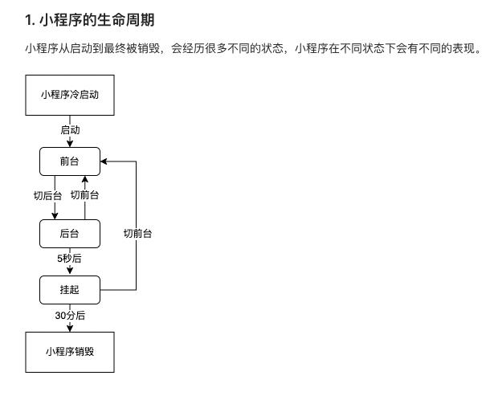

## 小程序分包
- 整个小程序所有分包大小不超过 16M（主包 + 所有分包）
- 单个分包/主包大小不能超过 2M
- tabBar 页面需要放到主包
- 当用户进入分包内某个页面时，客户端会把对应分包下载下来，下载完成后再进行展示
- 非 tabBar 页面可以按照功能的不同，划分为不同的分包之后，进行按需下载

### 独立分包和普通分包的区别
- 普通分包必须依赖于主包才能运行
- 独立分包可以在不下载主包的情况下，独立运行

### 独立分包的应用场景
- 当小程序从普通的分包页面启动时，需要首先下载主包
- 而独立分包不依赖主包即可运行，可以很大程度上提升分包页面的启动速度
- 在分包配置independent: true即是独立分包

### 分包预下载
> 分包预下载指的是：在进入小程序的某个页面时，由框架自动预下载可能需要的分包，从而提升进入后续分包页面时的启动速度s
> 预下载分包的行为，会在进入指定的页面时触发。在 app.json 中，使用 preloadRule 节点定义分包的预下载
```json
 "preloadRule": {
    "pages/contact/contact": {
      "packages": [
        "p1"
      ],
      "network": "wifi"//network有“all”和“wifi”可以选
    }
  },
```
> 同一个分包中的页面享有共同的预下载大小限额 2M，限额会在工具中打包时校验。

## 小程序UpdateManager 更新机制

### 生命周期
- 

### 小程序启动方式
- 冷启动
第一次启动或者挂掉后启动，会触发appLunch
- 热启动
> 当小程序进入后台，客户端会维持一段时间的运行状态，超过一定时间后（目前是30分钟）会被微信主动销毁
进入后台后启动，会触发onShow,appLunch不会触发

### 冷更新
1、未启动时更新——（意味着微信客户端会在用户不在访问小程序期间，主动触发更新，最慢24小时内覆盖所有用户。如果用户在未覆盖期间进入小程序，则触发了启动时更新。）

2、启动时更新——（用户冷启动进入小程序时，均会检测小程序是否有更新版本，若有则后台默默更新，准备为下次冷启动时使用。需要注意的是，此时访问的仍是旧版本的小程序。如果此时想手动使用新版小程序，则可以使用官方API）


### 自动更新
微信客户端会有若干个时机取检查本地缓存，如果有新版本，那就进行小程序代码包的更新，但如果恰巧发布新版本后没有经过这些时机就打开小程序，那打开可能还会是旧版本的小程序