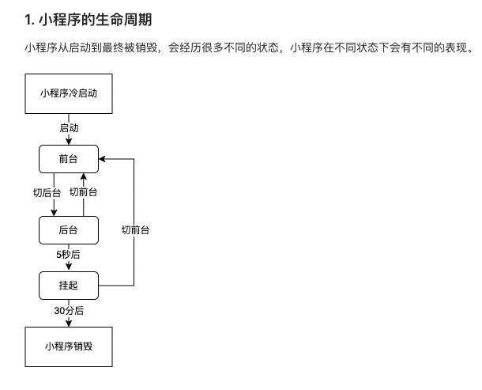

## 小程序UpdateManager 更新机制

### 生命周期
- 

### 小程序启动方式
- 冷启动
第一次启动或者挂掉后启动，会触发appLunch
- 热启动
> 当小程序进入后台，客户端会维持一段时间的运行状态，超过一定时间后（目前是30分钟）会被微信主动销毁
进入后台后启动，会触发onShow,appLunch不会触发

### 冷更新
1、未启动时更新——（意味着微信客户端会在用户不在访问小程序期间，主动触发更新，最慢24小时内覆盖所有用户。如果用户在未覆盖期间进入小程序，则触发了启动时更新。）

2、启动时更新——（用户冷启动进入小程序时，均会检测小程序是否有更新版本，若有则后台默默更新，准备为下次冷启动时使用。需要注意的是，此时访问的仍是旧版本的小程序。如果此时想手动使用新版小程序，则可以使用官方API）

### 自动更新
微信客户端会有若干个时机取检查本地缓存，如果有新版本，那就进行小程序代码包的更新，但如果恰巧发布新版本后没有经过这些时机就打开小程序，那打开可能还会是旧版本的小程序