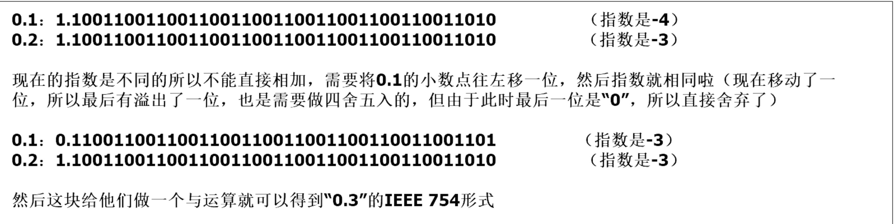

## JS常见数字问题
```js
// 1. 0.1 + 0.2 !== 0.3
// 2. 9007199254740992 === 9007199254740993 true // java返回long数字溢出问题
// 3. NaN === NaN false
```

## JS Number 编码方式
- JavaScript Number类型是一个双精度64位二进制格式的IEEE754值，类似于Java或C#中的double。这意味着它可以表示分数值，但存储的数字的大小和精度有一些限制
- 请注意，NaN值是由程序表达式NaN生成的。在某些实现中，外部代码可能能够检测各种不同的非数字值之间的差异，但这种行为是由实现定义的；对于ECMAScript代码来说，所有NaN值彼此之间是无法区分的

## 术语解释
### 什么是IEEE 754？
- IEEE754是由电气和电子工程师协会（IEEE）于1985年制定的浮点数运算技术标准。 （目前：IEEE 754-2019） 
- 这个标准定义了表示浮点数的格式（包括负零-0）与次正规数（Denormalized Number），一些特殊数值（无穷（Inf）与非数值（NaN）），以及这些数值的“浮点数运算符”；它也指明了四种数值舍入规则和五种例外状况（包括例外发生的时机与处理方式）
- IEEE 754规定，对于规定了四种表示浮点数值的方式：单精确度（32位）、双精确度（64位）、延伸单精确度（43比特以上，很少使用）与延伸双精确度（79比特以上，通常以80位实现） 

### 定点数
- 在定点数表达法中，其小数点固定地位于实数所有数字中间的某个位置。例如，货币的表达就可以采用这种表达方式，如 55.00 或者 00.55 可以用于表达具有 4 位精度，小数点后有两位的货币值。由于小数点位置固定，所以可以直接用 4 位数值来表达相应的数值
- 缺点：就在于其形式过于僵硬，固定的小数点位置决定了固定位数的整数部分和小数部分，不利于同时表达特别大的数或者特别小的数
- eg： Number.prototype.toFixed返回的就是十进制小数定点表示法的字符串

### 浮点数
> 浮点数利用指数达到了浮动小数点的效果，从而可以灵活地表达更大范围的实数
- 符号位（sign）：0表示正数，而1表示负数。
- 偏移指数（exponent）：指数字段需要同时表示正指数和负指数。为了得到存储的指数，实际指数会加上一个偏差(-1022 to 1023)。
- 尾数（mantissa）：尾数（也称为有效数）是表示实际值（有效位数）的数字部分。

### 双精度浮点数


### 十进制数转为754格式的运算过程
```txt
85.125
85 = 1010101
0.125 = 001
85.125 = 1010101.001
       =1.010101001 x 2^6 
sign = 0 

0.125->0.001的计算过程：
0.125 * 2 = 0.25 整数位：0
0.25 * 2 = 0.5 整数位：0
0.5 * 2 = 1 整数位：1
所以就是0.001

转换为754双精度格式：
偏移指数：1023+6=1029
转为二进制：1029 = 10000000101
尾数 = 010101001，不足52位，就在后面补0

最终结果：0 10000000101 0101010010000000000000000000000000000000000000000000
16进制形式：4055480000000000 

0.3转为二进制计算过程:
0.3 * 2 = 0.6 整数位: 0
0.6 * 2 = 1.2 整数位: 1
0.2 * 2 = 0.4 整数位: 0
0.4 * 2 = 0.8 整数位: 0
0.8 * 2 = 1.6 整数位: 1
0.6 * 2 = 1.2 整数位: 1
0.2 * 2 = 0.4 整数位: 0
...开始不断循环
所以0.3 约等于 0.0100110011001...1001，所以不能准确表示
```

### 运算例子
- 
- 

### 指数偏移常数


### 0.1+0.2运算过程
- 

### 能够表示的最大整数
> 大整数的精度丢失和浮点数本质上是一样的，尾数位最大是 52 位，因此 JS 中能精准表示的最大整数是 Math.pow(2, 53) - 1，十进制即 9007199254740991（Number.MAX_SAFE_INTEGER）(16位)
> 解决办法：让后端返回Long形整数的时候，转成字符串
> 后端返回科学计数法字符串
> 平时开发自己运算时，可以使用big.js,BigInt,json-bigint等方式解决

### 小数的产生
- 用户输入小数，小数加法，小数乘整数（可以通过乘1000解决）
- 数字除法运算产生小数，或者乘百分数（需要舍入）

## 常量
- Number.EPSILON: 是1和大于1的最小值之间的差值的数值，该数值可表示为数值，约为2.2204460492503130808472633361816×10^-16。0.1 + 0.2 - 0.3 < Number.EPSILON
- Number.isSafeInteger: If abs(ℝ(number)) ≤ 2^53 - 1, return true.
- Number.MAX_SAFE_INTEGER: 9007199254740991(2^53 - 1)
- Number.MIN_SAFE_INTEGER: -9007199254740991(-(2^53 - 1))
- Number.MAX_VALUE: 1.7976931348623157 × 10^308
- Number.MIN_VALUE: 5 × 10^-324

## 参考文章
- [MDN JS Number](https://developer.mozilla.org/en-US/docs/Web/JavaScript/Reference/Global_Objects/Number)
- [ECMASCript Number标准](https://tc39.es/ecma262/#sec-number-objects)
- [为什么计算机编程语言中：0.1+0.2不等于0.3](https://www.cnblogs.com/hai-long/p/12552148.html)
- [IEEE 754浮点数标准详解](http://c.biancheng.net/view/314.html)
- [JavaScript中的数字存储](https://fengmumu1.github.io/2018/06/30/js-number/)