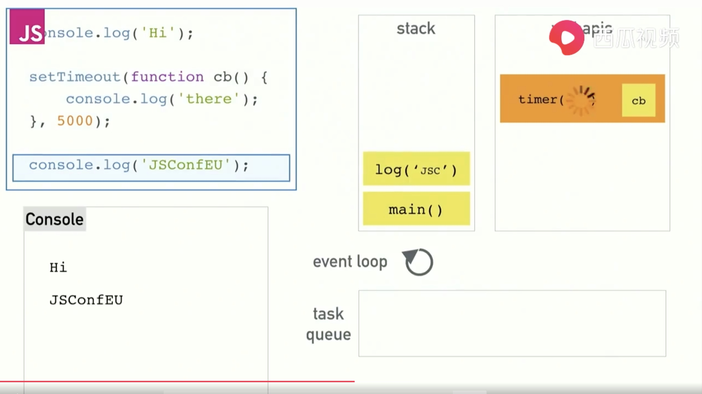
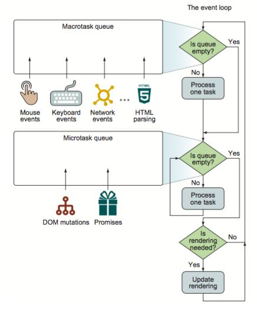
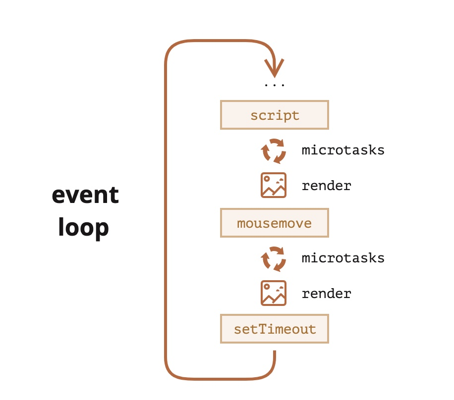
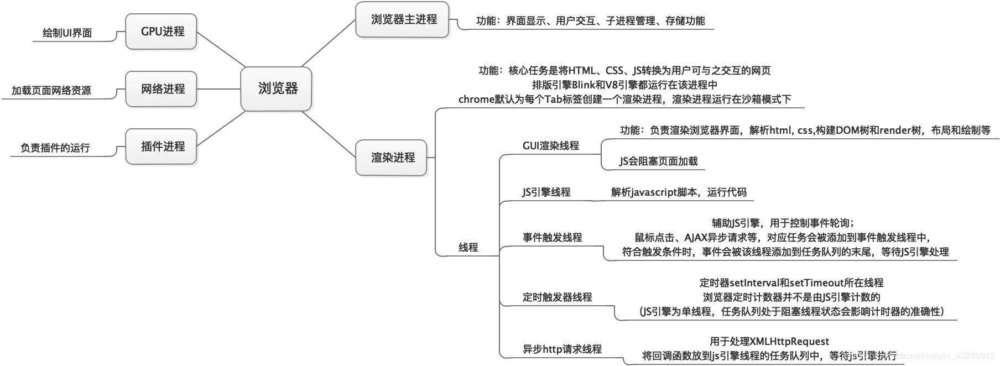
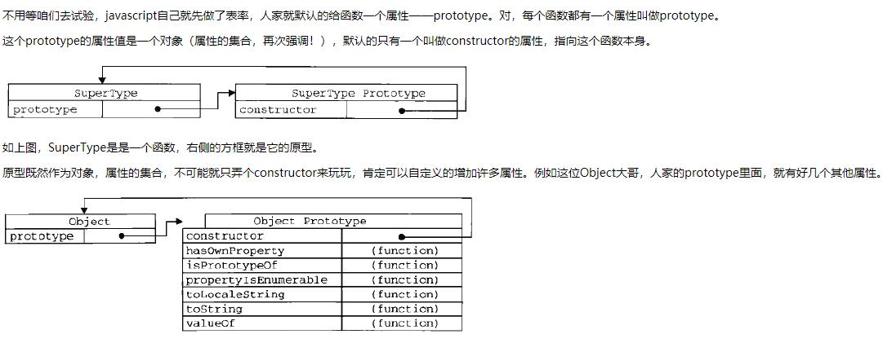
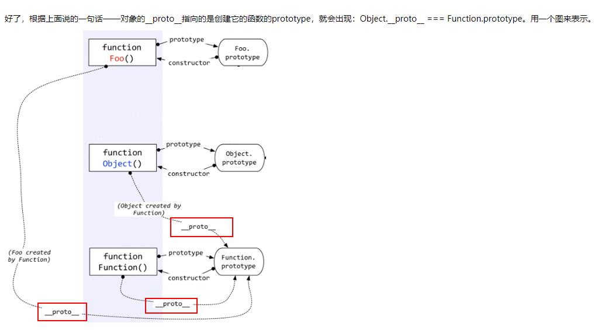
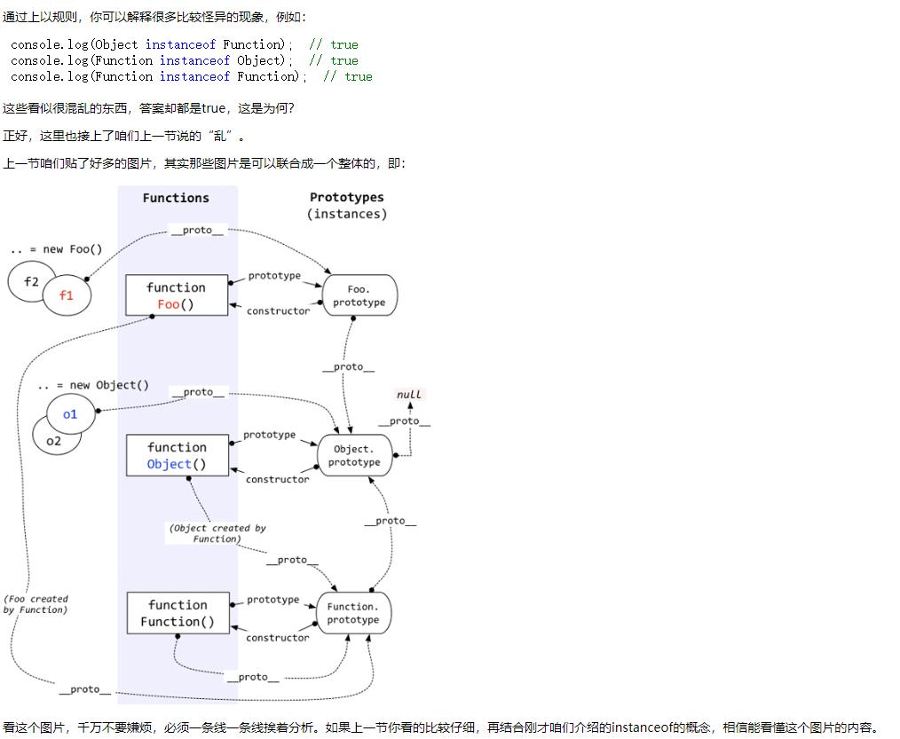
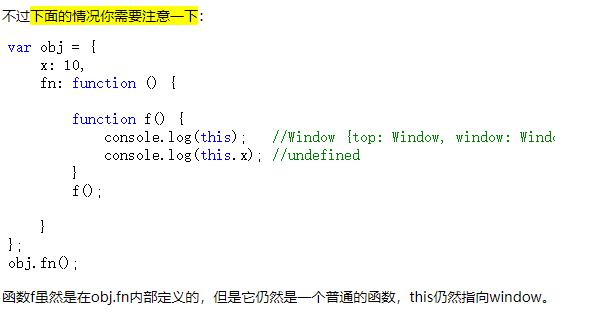

## 讲讲JS的数据类型？
最新的 ECMAScript 标准定义了 9种数据类型:

### 7 种原始类型【primitive】
- Boolean
- Undefined
- Null
- Number
- BigInt  11n,22n这就是这个类型的
- String
- Symbol  let s = Symbol()

### 2 种结构类型
- Object
- Function

## Symbol类型
由于ES5中对象属性名都是字符串，有可能造成命名重复，所以ES6提出的Symbol类型解决这个问题。Symbol 值通过Symbol函数生成。
```js
let s = Symbol();
window[s] = 1000;//第一种写法
let a = {
  [s]: 'Hello!'//第二种写法
};
Object.defineProperty(a, s, { value: 'Hello!' });//第三种写法
console.log(window[s]);//1000
window.s //这样不行，不能用点运算符。因为点运算符后面总是字符串

typeof s
// "symbol"
```
> 上面代码中，变量s就是一个独一无二的值。typeof运算符的结果，表明变量s是 Symbol 数据类型，而不是字符串之类的其他类型。
:::danger
注意，Symbol函数前不能使用new命令，否则会报错。这是因为生成的 Symbol 是一个原始类型的值，不是对象。也就是说，由于 Symbol 值不是对象，所以不能添加属性。基本上，它是一种类似于字符串的数据类型。
:::

### Symbol函数可以接受一个字符串作为参数
表示对 Symbol 实例的描述，主要是为了在控制台显示，或者转为字符串时，比较容易区分。
:::danger
注意，Symbol函数的参数只是表示对当前 Symbol 值的描述，因此相同参数的Symbol函数的返回值是不相等的。
:::
```js
let s1 = Symbol('foo');
let s2 = Symbol('bar');

s1 // Symbol(foo)
s2 // Symbol(bar)

s1.toString() // "Symbol(foo)"
s2.toString() // "Symbol(bar)"

//ES2019 提供description可以读取描述
s1.description // "foo"

// 有参数的情况
let s1 = Symbol('foo');
let s2 = Symbol('foo');

s1 === s2 // false
```

### 如果 Symbol 的参数是一个对象
就会调用该对象的toString方法，将其转为字符串，然后才生成一个 Symbol 值。
```js
const obj = {
  toString() {
    return 'abc';
  }
};
const sym = Symbol(obj);
sym // Symbol(abc)
```

### Symbol 类型转化
Symbol 值不能与其他类型的值进行运算，会报错，但是可以转为字符串和布尔值，不能转为数值
```js
let s = Symbol();
s + 'abc' //会报错
s.toString() //可以
String(s) //可以
Boolean(s) //可以
!s //可以
```

### Symbol作为属性名被遍历
遍历对象的时候，该属性不会出现在for...in、for...of循环中，也不会被Object.keys()、Object.getOwnPropertyNames()、JSON.stringify()返回。

但是，它也不是私有属性，有一个Object.getOwnPropertySymbols()方法，可以获取指定对象的所有 Symbol 属性名。该方法返回一个数组，成员是当前对象的所有用作属性名的 Symbol 值。
```js
const obj = {};
let a = Symbol('a');
let b = Symbol('b');

obj[a] = 'Hello';
obj[b] = 'World';

const objectSymbols = Object.getOwnPropertySymbols(obj);

objectSymbols
// [Symbol(a), Symbol(b)]
```

## 异步编程实现方式
- 回调函数
	+ 优点：简单、容易理解
	+ 缺点：不利于维护，代码耦合高
- 事件监听(采用时间驱动模式，取决于某个事件是否发生)【Dom添加事件监听】
	+ 优点：容易理解，可以绑定多个事件，每个事件可以指定多个回调函数
	+ 缺点：事件驱动型，流程不够清晰
- 发布/订阅(观察者模式)【pubSub库】
	+ 类似于事件监听，但是可以通过‘消息中心‘，了解现在有多少发布者，多少订阅者
- Promise对象
	+ 优点：可以利用then方法，进行链式写法；可以书写错误时的回调函数；
	+ 缺点：编写和理解，相对比较难
- Generator函数
	+ 优点：函数体内外的数据交换、错误处理机制
	+ 缺点：流程管理不方便
- async函数
	+ 优点：内置执行器、更好的语义、更广的适用性、返回的是Promise、结构清晰。
	+ 缺点：错误处理机制

## 找到A节点的父节点下的所有子节点
```js
var b=document.getElementById("a").parentNode.children;
console.log(b)
```
    
## encodeURI和encodeURIComponent的比较
- 相同点：都可以对url进行一个编码；
- encodeURI()不会对本身属于URI的特殊字符进行编码，例如冒号、下划线、问号和井字号，适用于url跳转时；
- encodeURIComponent()则会对它发现的任何非标准字符进行编码，适用于有参数要传递时。
> 注意：当url作为参数传递时如果没有用encodeURIComponent进行编码，往往会造成传递时url中的特殊字符丢失。

## 事件循环【Event Loop】
### Event Loop是什么？
Event Loop即事件循环，是指浏览器或Node的一种解决javaScript单线程运行时不会阻塞的一种机制，也就是异步的原理
- 事件指的是任务栈完成时，或者异步操作完成时的事件
- 循环指的是，循环检查任务栈是否空，空了就执行任务队列，一直循环





### Event Loop执行流程
1. 执行全局Script同步代码，这些同步代码有一些是同步语句，有一些是异步语句（比如setTimeout等）；
2. 全局Script代码执行完毕后，调用栈Stack会清空；
3. 从微队列microtask queue中取出位于队首的回调任务，放入调用栈Stack中执行，执行完后microtask queue长度减1；
4. 继续取出位于队首的任务，放入调用栈Stack中执行，以此类推，直到直到把microtask queue中的所有任务都执行完毕。注意，如果在执行microtask的过程中，又产生了microtask，那么会加入到队列的末尾，也会在这个周期被调用执行；
5. microtask queue中的所有任务都执行完毕，此时microtask queue为空队列，调用栈Stack也为空；
	+ 1.当 Eventloop 执行完 Microtasks 后，会判断 document 是否需要更新，因为浏览器是 60Hz 的刷新率，每 16.6ms 才会更新一次。
	+ 2.然后判断是否有 resize 或者 scroll 事件，有的话会去触发事件，所以 resize 和 scroll 事件也是至少 16ms 才会触发一次，并且自带节流功能。
	+ 3.判断是否触发了 media query
	+ 4.更新动画并且发送事件
	+ 5.判断是否有全屏操作事件
	+ 6.执行 requestAnimationFrame 回调
	+ 7.执行 IntersectionObserver 回调，该方法用于判断元素是否可见，可以用于懒加载上，但是兼容性不好
	+ 8.更新界面
	+ 9.以上就是一帧中可能会做的事情。如果在一帧中有空闲时间，就会去执行 requestIdleCallback 回调。
6. 取出宏队列macrotask queue中位于队首的任务，放入Stack中执行；
7. 执行完毕后，调用栈Stack为空；
8. 重复第3-7个步骤；
9. 重复第3-7个步骤；
10. ......
:::tip
- 宏队列macrotask一次只从队列中取一个任务执行，执行完后就去执行微任务队列中的任务；
- 微任务队列中所有的任务都会被依次取出来执行，直到microtask queue为空; 在 UI 重新渲染之前执行，避免了不必要的 UI 渲染。；
- [参考文章](https://segmentfault.com/a/1190000016278115)
- [腾讯云专栏](https://cloud.tencent.com/developer/article/1533889)
:::
### 什么是进程？
> 在传统OS中，进程包含了系统资源和能够独立调度和分派，在创建，撤销和切换过程中要耗费很多时间，为了减少并发的时空开销，提升并发性，引入了线程。把进程分为了多个线程和资源。线程就成为了系统调度和分派的基本单位。（线程的切换代价更低）
- 进程是程序的一次执行
- 进程是具有独立功能的程序在一个数据集合上运行的过程，它是系统进行资源分配和调度的一个独立单位

### 什么是线程？
- 线程是CPU调度的最小单位，它是比进程更小的能独立运行的基本单位，由进程派生
- 线程自己基本上不拥有系统资源，只拥有一点在运行中必不可少的资源(如程序计数器，一组寄存器和栈)，但它可与多个线程共享该进程的所拥有的资源

### 什么是单线程？
单线程是指JS引擎执行JS时只分了一个线程给他执行，也就是执行JS时是单线程的。因为JS是单线程，所以如果没有事件循环，JS中将都是同步代码。

### 浏览器内核
- [详解](https://blog.csdn.net/wu_xianqiang/article/details/105837869)

- V8引擎由许多子模块构成，其中这4个模块是最重要的
	+ Parser：负责将JavaScript源码转换为Abstract Syntax Tree (AST)
	+ Ignition：interpreter，即解释器，负责将AST转换为Bytecode，解释执行Bytecode；同时收集3. TurboFan优化编译所需的信息，比如函数参数的类型；
	+ TurboFan：compiler，即编译器，利用Ignition所收集的类型信息，将Bytecode转换为优化的汇编代码；
	+ Orinoco：garbage collector，垃圾回收模块，负责将程序不再需要的内存空间回收；

### 调用栈（Call Stack）
调用栈它里面装的东西，是一个个待执行的函数。
> Event Loop 会一直检查 Call Stack 中是否有函数需要执行，如果有，就从栈顶依次执行。同时，如果执行的过程中发现其他函数，继续入栈然后执行。

### 任务分为两类
- 同步任务：没有被引擎挂起、在主线程上排队执行的任务。只有前一个任务执行完毕，才能执行后一个任务。
	+ 网页的渲染过程就是一大堆同步任务，比如页面骨架和页面元素的渲染
- 异步任务：被引擎放在一边，不进入主线程、而进入任务队列的任务。只有引擎认为某个异步任务可以执行了（比如 Ajax 操作从服务器得到了结果），该任务的回调函数加入宏任务队列中，最后加入调用栈执行。排在异步任务后面的代码，不用等待异步任务结束会马上运行，也就是说，异步任务不具有“堵塞”效应。
	+ 而像加载图片音乐之类占用资源大耗时久的任务，就是异步任务

### 参考文章
- [setTimeout在event中如何执行的](https://www.educative.io/edpresso/what-is-an-event-loop-in-javascript)
- [事件循环](https://zhuanlan.zhihu.com/p/265349066)
- [讲的最好的](https://javascript.info/event-loop#macrotasks-and-microtasks)
- [什么是事件循环](http://www.ruanyifeng.com/blog/2013/10/event_loop.html)
- [视频讲解](https://www.ixigua.com/6806218718264164877?wid_try=1)
- [详解](https://www.cnblogs.com/mfyngu/p/11747533.html)
- [面试](https://www.jianshu.com/p/bfc3e319a96b)

### 执行顺序测试题
```js
    console.log('script start');
    
    setTimeout(function() {
      console.log('setTimeout');
    }, 0);
    
    Promise.resolve().then(function() {
      console.log('promise1');
    }).then(function() {
      console.log('promise2');
    });
    
    console.log('script end');
    
    //结果script start, script end, promise1, promise2, setTimeout
```
> await后面的就相当于放在Promise的then里面
```js
async function testFn() {
	setTimeout(() => {
		console.log('timeout');
	});
	new Promise((resolve) => {
		console.log('promise resolve: ', 1111);
		resolve();
	}).then(() => {
		console.log('promise then: ', 222222);
	});
	
	console.log('await before: ', 1);
	const rep = await Promise.resolve(1);
	console.log('await after: ', rep);
	
	
	new Promise((resolve) => {
		console.log('promise resolve: ', 3333);
		resolve();
	}).then(() => {
		console.log('promise then: ', 444);
	});
}
//promise resolve:  1111
//await before:  1
//promise then:  222222
//await after:  1
//promise resolve:  3333
//promise then:  444
//timeout
```
    
### 那怎么知道主线程执行栈为空呢？
js引擎存在monitoring process进程，会持续不断的检查主线程执行栈是否为空，一旦为空，就会去任务队列那里检查是否有等待被调用的函数。

### 加入async的执行顺序测试题
[加入async看顺序](https://www.cnblogs.com/shaozhu520/p/11341030.html)
- async执行返回值是一个promise，遇见promise会resolve它
    
## 宏任务与微任务
> 除了广义的同步任务和异步任务，JavaScript 单线程中的任务可以细分为宏任务和微任务。
> 宏任务是由宿主发起的，而微任务由JavaScript自身发起
- 宏任务：由标准机制执行的任何JavaScript代码，宏任务代表一些离散和独立的工作，宏任务中的事件放在macroqueue中，由事件触发线程维护；
- 微任务：当前（此次事件循环中）宏任务执行完，在下一个宏任务开始之前需要执行的任务为微任务。微任务的事件放在microqueue中，由js引擎线程维护；

### html规范定义
[html规范](https://html.spec.whatwg.org/multipage/webappapis.html#event-loop-processing-model)
[MDN定义](https://developer.mozilla.org/en-US/docs/Web/API/HTML_DOM_API/Microtask_guide)

### 有哪些是宏任务（macrotask queue）
- event callback
- 整体代码script
- setTimeout/setInterval
- setImmediate,I/O(Node)
- requestAnimationFrame

### 有哪些是微任务（microtask queue）
- 原生Promise.then
- process.nextTick(Node)
- Object.observe(已废弃,Proxy 对象替代)
- MutationObserver（监控某个 DOM 节点, 替代Mutation Events）
> MutationObserver用于，监听元素子项的删除，新增，修改(包括删除和新增），目标节点的属性节点变化，文本内容是否发生变化，属性节点变化。
> 用于模拟微任务
:::tips
MutationObserver比较于Mutation Events，提升了性能。
- MutationObserver所有监听操作以及相应处理都是在其他脚本执行完成之后异步执行的，并且是所以变动触发之后，将变得记录在数组中，统一进行回调的，也就是说，当你使用observer监听多个DOM变化时，并且这若干个DOM发生了变化，那么observer会将变化记录到变化数组中，等待一起都结束了，然后一次性的从变化数组中执行其对应的回调函数。
- Mutation Events是同步执行的，它的每次调用，都需要从事件队列中取出事件，执行，然后事件队列中移除，期间需要移动队列元素。并且Mutation Events是事件，所以捕获是采用的是事件冒泡的形式，如果冒泡捕获期间又触发了其他的MutationEvents的话，很有可能就会导致阻塞Javascript线程，甚至导致浏览器崩溃。
:::
```js
// Firefox和Chrome早期版本中带有前缀
var MutationObserver = window.MutationObserver || window.WebKitMutationObserver || window.MozMutationObserver
// 选择目标节点
var target = document.querySelector('#some-id'); 
// 创建观察者对象
var observer = new MutationObserver(function(mutations) {  
  mutations.forEach(function(mutation) { 
    console.log(mutation.type); 
  }); 
}); 
// 配置观察选项:
var config = { attributes: true, childList: true, characterData: true } 
// 传入目标节点和观察选项
observer.observe(target, config); 
// 随后,你还可以停止观察
observer.disconnect();
```


## repaint（重绘）和 reflow（回流）
- 回流：比如我们增删DOM节点，修改一个元素的宽高，页面布局发生变化，DOM树结构发生变化，那么肯定要重新构建DOM树，而DOM树与渲染树是紧密相连的，DOM树构建完，渲染树也会随之对页面进行再次渲染，这个过程就叫回流。
- 重绘：元素的某一部分属性发生改变，如字体颜色，背景颜色等改变，尺寸并未改变，这时发生的改变过程就是repaint。

### 基本上能引起reflow的主要有几个原因
- 网页初始化
- DOM的增删
- 某些元素的尺寸改变，最好放在一个class中修改
- display: none
- 元素位置的变化，元素的左右margin，padding，所以使用定位或者transform性能更好
- 获取元素的偏移量属性，scrollTop、scrollLeft、scrollWidth、offsetTop、offsetLeft、offsetWidth、offsetHeight，浏览器为了保证值的正确也会回流取得最新的值，所以如果你要多次操作，最取完做个缓存
- 浏览器窗口尺寸改变，resize事件发生也会引起回流

### reflow影响性能，优化方法如下
- 移动位置的时候使用transform而不是position
- 修改样式不要逐条修改，建议定义CSS样式的class，然后直接修改元素的className
- 不要将DOM节点的属性值放在循环中当成循环的变量
- 为动画的 HTML 元素使用 fixed 或 absoulte 的 position，那么修改他们的 CSS 是不会 reflow 的
- 把DOM离线后修改。如设置DOM的display：none，然后进行你需要的多次修改，然后再显示出来，或者clone一个节点到内存中，然后随意修改，修改完成后再与在线的交换【虚拟Dom，Diff算法就是这么优化的】
- 不使用table布局，因为一个微小的改变就可能引起整个table的重新布局,当我们不为表格td添加固定宽度时，一列的td的宽度会以最宽td的宽作为渲染标准，假设前几行td在渲染时都渲染好了，结果下面某行的一个td特别宽，table为了统一宽，前几行的td会回流重新计算宽度，这是个很耗时的事情。
- 使用visibility替代display: none。由于display为none的元素在页面不需要渲染，渲染树构建不会包括这些节点；但visibility为hidden的元素会在渲染树中。因为display为none会脱离文档流，visibility为hidden虽然看不到，但类似与透明度为0，其实还在文档流中，还是有渲染的过程。

## JavaScript原型，原型链 ? 有什么特点？
### 原型prototype
> 原型就是，创建一个函数时，会同时创建一个对象，函数的prototype会指向这个对象，然后这个对象默认有个属性叫constructor，指向这个函数。prototype指向的对象就是函数的原型对象，简称函数的原型

- 每个函数都有一个属性，叫prototype，它的值是一个对象，默认包含constructor属性，constructor属性是指向自己（即构造函数）。在Object函数的prototype中，还包含toString, hasOwnProperty等方法，所以创建的对象可以直接使用toString等方法
- 每个对象都有一个隐藏的属性——“__proto__”，这个属性指向创建这个对象的函数的prototype。即：fn.__proto__ === Fn.prototype（除了Object.create(null)没有），所以对象可以访问原型上的属性和方法


### 实例 
> 通过构造函数和new创建出来的对象，便是实例。 实例通过__proto__指向它构造函数的原型，通过constructor指向构造函数。

### 原型链
访问一个对象的属性时，先在基本属性中查找，如果没有，再沿着__proto__这条链向上找，直至最顶级的原型对象Object.prototype，这就是**原型链**。

### 如何区分一个属性到底是基本的还是从原型中找到的呢
通过hasOwnProperty方法，特别是在for…in…循环(enumerable)中，一定要注意。

### instanceof原理
Instanceof的判断准则是：沿着A的__proto__这条线来找，同时沿着B的prototype这条线来找，如果两条线能找到同一个引用，即同一个对象，那么就返回true。如果找到终点还未重合，则返回false。


### 特点
JavaScript 对象是通过引用来传递的，我们创建的每个新对象实体中并没有一份属于自己的原型副本。当我们修改原型时，与之相关的对象也会继承这一改变当我们需要一个属性的时， Javascript 引擎会先看当前对象中是否有这个属性，如果没有的,就会查找__proto__这条线来找。

## 说一下继承的几种方式及优缺点？
### 原型链继承
```js
function P() {}//父类
function C() {}//子类
C.prototype = new P();
C.prototype.name = 'yes';
let cItem = new C();
```
缺点
1. 新实例无法向父类构造函数传参。
2. 所有新实例都会共享父类实例的属性。（原型上的属性是共享的，一个实例修改了原型属性，另一个实例的原型属性也会被修改！）

### 借用/盗用 构造函数继承
```js
function P() {}//父类
function C() {P.call(this, "jer")}//子类
let cItem = new C();
```
缺点
1. 只能继承父类构造函数的属性
2. 无法实现构造函数的复用（每次用每次都要重新调用）
3. 每个新实例都有父类构造函数的副本，臃肿

### 组合继承（组合原型链继承和借用构造函数继承）（常用）
```js
function P() {}//父类
function C(name) {P.call(this, name);}//子类
C.prototype = new P();
C.prototype.name = 'yes';
let cItem = new C("pig");
```
- 特点：
1. 可以继承父类原型上的属性，可以传参，可复用。
2. 每个新实例引入的构造函数属性是私有的。
- 缺点：
1. 调用了两次父类构造函数（耗内存）
2. 子类的构造函数会代替原型上的那个父类构造函数。

### 寄生式继承
```js
function createAnother(original){ 
 let clone = object(original); // 通过调用函数创建一个新对象
 clone.sayHi = function() { // 以某种方式增强这个对象
 console.log("hi"); 
 }; 
 return clone; // 返回这个对象
} 
```

### 寄生组合式继承（常用）
```js
function inheritPrototype(subType, superType) { 
 let prototype = Object.create(superType.prototype); // 创建对象, 深拷贝
 prototype.constructor = subType; // 增强对象
 
 subType.prototype = prototype; // 赋值对象
} 

function SuperType(name) { 
 this.name = name; 
 this.colors = ["red", "blue", "green"]; 
} 

SuperType.prototype.sayName = function() { 
 console.log(this.name); 
}; 

function SubType(name, age) { 
 SuperType.call(this, name); 
  this.age = age; 
} 

inheritPrototype(SubType, SuperType); 
SubType.prototype.sayAge = function() { 
 console.log(this.age); 
};
```
:::tip
这里只调用了一次 SuperType 构造函数，避免了 SubType.prototype 上不必要也用不到的属性，因此可以说这个例子的效率更高。而且，原型链仍然保持不变，因此 instanceof 操作符和isPrototypeOf()方法正常有效。寄生式组合继承可以算是引用类型继承的最佳模式。
:::

### 原型式继承，就是对象浅拷贝，Object.create方法
```js
function object(o) { 
 function F() {} 
 F.prototype = o; 
 return new F(); 
} 
```
- 构造函数中的共有属性无法做到数据共享，要做到数据共享，需要用到prototype

## 闭包
:::tip
当函数可以记住并访问所在的词法作用域，即使函数是在当前词法作用域之外执行，这时就产生了闭包。
:::
```js
function wait(message) { 
	setTimeout( 
		function timer() { console.log( message ); }, 
	1000 ); 
}
wait( "Hello, closure!" );
//将一个内部函数（名为 timer）传递给 setTimeout(..)。timer 具有涵盖 wait(..) 作用域 的闭包，因此还保有对变量 message 的引用。wait(..) 执行 1000 毫秒后，它的内部作用域并不会消失，timer 函数依然保有 wait(..) 作用域的闭包。
```


## 作用域
> 作用域是一套设计良好的存储变量和访问变量的规则
- 如果是对变量进行赋值，使用LHS查询，非严格模式下，会创建全局变量，严格模式下，会报ReferenceError
- 如果是取值，使用RHS查询, 如果失败，会报ReferenceError异常。如果对变量进行不合理操作，会报TypeError（比如对普通变量进行函数调用）

### 三个角色
- 引擎，从头到尾负责整个 JavaScript 程序的编译及执行过程
	+ 编译器，负责语法分析及代码生成等脏活累活
	+ 作用域，负责收集并维护由所有声明的标识符（变量）组成的一系列查 询，并实施一套非常严格的规则，确定当前执行的代码对这些标识符的访问权限

### 作用域类型
- 全局作用域，Global，任何地方都可见
- 模块作用域，Module，模块内可见
- 函数作用域，Function，函数内可见，子函数，子块可见
- 块级作用域，Block，块内可见
	+ with作用域，传入一个对象，在with中可以直接使用它的属性
	+ try/catch
	+ let 关键字可以将变量绑定到所在的任意作用域中（通常是 { .. } 内部）,let 循环，重新赋值。ES6规定块级作用域可以嵌套函数
	+ const ，和let差不多，区别是不能改

```js
const obj = {
	a: 10,
	b: 100
};

with(obj) {
	cossole.log(a)
};

try {
	
} catch (err) {
	console.log(err);
}
```

### 作用域共有两种主要的工作模型
- 词法作用域,词法作用域就是定义在词法阶段的作用域
> 词法作用域是由你在写代码时将变量和块作用域写在哪里来决定的，因此当词法分析器处理代码时会保持作用域 不变（大部分情况下是这样的）。除了(eval,with等欺骗词法作用域方法。)
- 动态作用域

### 作用域嵌套
多个作用域可以相互嵌套，

### 编译原理
1. 分词/词法分析，把代码拆分成代码块，token
2. 解析/语法分析，把词法单元流（数组）转为AST，抽象语法树
3. 代码生成，把AST转为可执行代码

## 作用域链
> 函数是特殊的可执行对象,函数中存在这一个内部属性[[Scope]]（我们不能使用，供js引擎使用）.
> 函数被创建时，这个内部属性就会包含函数被创建的作用域中对象的集合，这个集合呈链式链接，被称为函数的作用域链。
> 作用域链上的每一个对象被称为可变对象（Variable Obejct），每一个可变对象都以键值对形式存在。
我们知道，我们可以在执行上下文中访问到父级甚至全局的变量，这便是作用域链的功劳。作用域链可以理解为一组对象列表，包含 父级和自身的变量对象，因此我们便能通过作用域链访问到父级里声明的变量或者函数。(在 fn 函数中，取自由变量 x 的值时，要到哪个作用域中取？——要到创建 fn 函数的那个作用域中取，无论 fn 函数将在哪里调用。)
- 由两部分组成:
	+ [[scope]]属性: 指向父级变量对象和作用域链，也就是包含了父级的[[scope]]和AO
	+ AO（Activation object）: 自身活动对象
如此 [[scope]]包含[[scope]]，便自上而下形成一条 链式作用域。
### 例子
```js
var a = 1;
function foo(){
    ...
}
```
它对应的[scope]
```js
// 伪代码
foo.[[Scope]] = {
	GO: {
		this: window ,
		window: ... ,
		document: ... ,
		......
		a: undefined, // 预编译阶段还不知道a值是多少
		foo: function(){...},
	}
}
```

### [[Scope]]和执行上下文的区别
- 共同：都保存了函数作用域链
- [[Scope]]属性是函数创建时产生的，会一直存在
- 而执行上下文在函数执行时产生，且每次调用都产生不同的上下文，因为不同的调用可能就会有不同的参数，函数执行结束便会销毁
- 上下文关联了一个对象，叫变量对象，它包含了上下文中定义的所有函数和变量，this。如果是函数上下文，还有arguments，自由变量的取值作用域
> 执行上下文环境---在执行代码之前，把将要用到的所有的变量都事先拿出来，有的直接赋值了，有的先用undefined占个空

### 自由变量
```js
var a = 10;
function fn() {
    console.log(a);//a就是自由变量，函数创建时就确定了a要取值的作用域
}

function bar(f) {
    var a = 20;
    f();//输出10
}

bar(fn);
```

### 参考文章
- [CSDN详解](https://blog.csdn.net/q1056843325/article/details/53086893)
- [深入理解javascript原型和闭包（完结）](https://www.cnblogs.com/wangfupeng1988/p/3977924.html)
- [context和scope的区别](https://modernweb.com/understanding-scope-and-context-in-javascript/#:~:text=Fundamentally%2C%20scope%20is%20function%2Dbased,owns%E2%80%9D%20the%20currently%20executing%20code.)

## 函数上下文
一般指的函数的this

## 执行上下文(EC)/执行环境
> JS代码在执行前，JS引擎总要做一番准备工作，这份工作其实就是创建对应的执行上下文；
> 执行上下文可以简单理解为一个对象【内部对象】
- 它包含三个部分:
	+ 变量对象(VO)
	+ 作用域链(词法作用域)
	+ this指向
- 它的类型:
	+ 全局执行上下文，在客户端中一般由浏览器创建，就是windows对象
	+ 函数执行上下文，每当一个函数被调用时都会创建一个新的函数上下文，函数执行上下文栈管理它们
	+ eval执行上下文
- 代码执行过程:
	+ 创建 全局上下文 (global EC)
	+ 全局执行上下文 (caller) 逐行 自上而下 执行。遇到函数时，函数执行上下文 (callee) 被push到执行栈顶层
	+ 函数执行上下文被激活，成为 active EC, 开始执行函数中的代码，caller 被挂起
	+ 函数执行完后，callee 被pop移除出执行栈，控制权交还全局上下文 (caller)，继续执行

### 参考
[什么是JS执行上下文](https://www.cnblogs.com/Rivend/p/12616528.html)

### 特点
- 它定义了一个函数执行时的环境
- 函数每次执行时的执行环境独一无二
- 多次调用函数就多次创建执行环境
- 并且函数执行完毕后，执行环境就会被销毁
- 执行环境有自己的作用域链，用于解析标识符

### 上下文栈
在代码执行过程中，会产生多个上下文，通过一个上下文栈来进行管理，处于活动状态的执行上下文环境只有一个


### 执行上下文创建阶段
JS执行上下文的创建阶段主要负责三件事：
1. 确定this
2. 创建词法环境（LexicalEnvironment）
3. 创建变量环境（VariableEnvironment）

### 确定this
官方的称呼为This Binding，在全局执行上下文中，this总是指向全局对象，例如浏览器环境下this指向window对象。而在函数执行上下文中，this的值取决于函数的调用方式，如果被一个对象调用，那么this指向这个对象。否则this一般指向全局对象window或者undefined（严格模式）。

### 词法环境
词法环境是一个包含标识符变量映射的结构，这里的标识符表示变量/函数的名称，变量是对实际对象【包括函数类型对象】或原始值的引用。词法环境分为全局词法环境与函数词法环境两种
- 全局词法环境：对外部环境的引入记录为null，因为它本身就是最外层环境，除此之外它还包含了全局对象的所有属性方法，以及用户自定义的全局对象（通过var声明）。
- 函数词法环境：包含了用户在函数中定义的所有变量外，还包含了一个arguments对象。函数词法环境的外部环境引入可以是全局环境，也可以是其它函数环境，这个根据实际代码而来。
```js
// 全局环境
GlobalExectionContext = {
    // 全局词法环境
    LexicalEnvironment: {
        // 环境记录
        EnvironmentRecord: {
            Type: "Object", //类型为对象环境记录
            // 标识符绑定在这里 
        },
        outer: < null >
    }
};
// 函数环境
FunctionExectionContext = {
    // 函数词法环境
    LexicalEnvironment: {
        // 环境纪录
        EnvironmentRecord: {
            Type: "Declarative", //类型为声明性环境记录
            // 标识符绑定在这里 
        },
        outer: < Global or outerfunction environment reference >
    }
};
```

### 变量环境
变量环境可以说也是词法环境，它具备词法环境所有属性，一样有环境记录与外部环境引入。在ES6中唯一的区别在于词法环境用于存储函数声明与let const声明的变量，而变量环境仅仅存储var声明的变量。
```js
//全局执行上下文
GlobalExectionContext = {
    // this绑定为全局对象
    ThisBinding: <Global Object>,
    // 词法环境
    LexicalEnvironment: {  
        //环境记录
      EnvironmentRecord: {  
        Type: "Object",  // 对象环境记录
        // 标识符绑定在这里 let const创建的变量a b在这
        a: < uninitialized >,  
        b: < uninitialized >,  
        multiply: < func >  
      }
      // 全局环境外部环境引入为null
      outer: <null>  
    },
  
    VariableEnvironment: {  
      EnvironmentRecord: {  
        Type: "Object",  // 对象环境记录
        // 标识符绑定在这里  var创建的c在这
        c: undefined,  
      }
      // 全局环境外部环境引入为null
      outer: <null>  
    }  
  }
  
  // 函数执行上下文
    FunctionExectionContext = {
       //由于函数是默认调用 this绑定同样是全局对象
      ThisBinding: <Global Object>,
      // 词法环境
      LexicalEnvironment: {  
        EnvironmentRecord: {  
          Type: "Declarative",  // 声明性环境记录
          // 标识符绑定在这里  arguments对象在这
          Arguments: {0: 20, 1: 30, length: 2},  
        },  
        // 外部环境引入记录为</Global>
        outer: <GlobalEnvironment>  
      },
    
      VariableEnvironment: {  
        EnvironmentRecord: {  
          Type: "Declarative",  // 声明性环境记录
          // 标识符绑定在这里  var创建的g在这
          g: undefined  
        },  
        // 外部环境引入记录为</Global>
        outer: <GlobalEnvironment>  
      }  
    }
```
> 不知道你有没有发现，在执行上下文创建阶段，函数声明与var声明的变量在创建阶段已经被赋予了一个值，var声明被设置为了undefined，函数被设置为了自身函数，而let  const被设置为未初始化。现在你总知道变量提升与函数声明提前是怎么回事了吧，以及为什么let const为什么有暂时性死域，这是因为作用域创建阶段JS引擎对两者初始化赋值不同。

### 变量对象
变量对象，是执行上下文中的一部分，可以抽象为一种 数据作用域，其实也可以理解为就是一个简单的对象，它存储着该执行上下文中的所有 变量和函数声明(不包含函数表达式)。
> 活动对象 (AO): 当变量对象所处的上下文为 active EC 时，称为活动对象。

### 作用域
执行上下文中还包含作用域链。理解作用域链之前，先介绍下作用域。作用域其实可理解为该上下文中声明的 变量和函数的作用范围。可分为 块级作用域 和 函数作用域。（js引擎根据名称查找变量的一套规则，确定作用域这个地盘中的变量，用的是哪个）
- 特性:
	+ 声明提前: 一个声明在函数体内都是可见的, 函数优先于变量
    + 作用域在函数定义时就已经确定了, 而不是在函数调用时确定
	+ 非匿名自执行函数，函数变量为 只读 状态，无法修改
    + 如果要查找一个作用域下某个变量的值，就需要找到这个作用域对应的执行上下文环境，再在其中寻找变量的值
    + 要到创建这个函数的那个作用域中取值——是“创建”，而不是“调用”，切记切记——其实这就是所谓的“静态作用域”
> 作用域最大的用处就是隔离变量，不同作用域下同名变量不会有冲突。例如以上代码中，三个作用域下都声明了“a”这个变量，但是他们不会有冲突。各自的作用域下，用各自的“a”。
```js
let foo = function() { console.log(1) };
(function foo() {//如果去掉foo，打印的就是10
    foo = 10  // 由于foo在函数中只为可读，因此赋值无效
    console.log(foo)
}()) 

// 结果打印：  ƒ foo() { foo = 10 ; console.log(foo) }
```

## 闭包
> 闭包属于一种特殊的作用域，称为 静态作用域。它的定义可以理解为: 父函数被销毁 的情况下，返回出的子函数的[[scope]]中仍然保留着父级的单变量对象和作用域链，因此可以继续访问到父级的变量对象，这样的函数称为闭包。

### 为什么有闭包？
如果没有闭包，则必须在函数之前显式传递更多参数，从而使参数列表更长，代码更嘈杂。才能达到闭包的效果。

### 特点：
- 函数内再嵌套函数
- 内部函数可以引用外层的参数和变量
- 参数和变量不会被垃圾回收机制回收
- 优点：能够实现封装和缓存等
- 缺点：消耗内存、使用不当会内存溢出，因为闭包保存了父级上下文
- 解决方法：在退出函数之前，将不使用的局部变量全部删除

## 上下文和作用域的区别
### 上下文环境
可以理解为一个看不见摸不着的对象（有若干个属性），虽然看不见摸不着，但确实实实在在存在的，因为所有的变量都在里面存储着，要不然咱们定义的变量在哪里存？另外，对于函数来说，上下文环境是在调用时创建的，这个很好理解。拿参数做例子，你不调用函数，我哪儿知道你要给我传什么参数？

### 两者
- 执行上下文在运行时确定，随时可能改变；作用域在定义时就确定，并且不会改变。
- 一个作用域下可能包含若干个上下文环境。有可能从来没有过上下文环境（函数从来就没有被调用过）；有可能有过，现在函数被调用完毕后，上下文环境被销毁了；有可能同时存在一个或多个（闭包）。

### JavaScript 属于解释型语言,JavaScript 的执行分为：解释和执行两个阶段,这两个阶段所做的事并不一样：
> JavaScript 解释阶段便会确定作用域规则，因此作用域在函数定义时就已经确定了，而不是在函数调用时确定，但是执行上下文是函数执行之前创建的。执行上下文最明显的就是 this 的指向是执行时确定的。
- 解释阶段
    + 词法分析
    + 语法分析
    + 作用域规则确定
- 执行阶段：
    + 创建执行上下文
    + 执行函数代码
    + 垃圾回收

## this的取值, 分五种情况
1. 构造函数，如果函数作为构造函数用，那么其中的this就代表它即将new出来的对象
2. 函数作为对象的一个属性，如果函数作为对象的一个属性时，并且作为对象的一个属性被调用时，函数中的this指向该对象。
```js
var obj = {
	name: 'aa',
	fn: function() {
		console.log(this.name)
	}
}
```
3. 函数用call或者apply调用, 当一个函数被call和apply调用时，this的值就取传入的对象的值。
4. 全局 & 调用普通函数, 在全局环境下，this永远是window

5. 监听事件回调函数中的this, 指向触发这个事件的对象，特殊的是， IE 中的 attachEvent 中的this 总是指向全局对象 Window


## new操作符具体干了什么呢?
- 创建一个空对象，并且 this 变量引用该对象，同时还继承了该函数的原型
- 属性和方法被加入到 this 引用的对象中
- 新创建的对象由 this 所引用，并且最后隐式的返回 this

## commonjs 规范
- exports = module.exports
- exports
- module
- require

## export和export default的区别？
```js
export default  xxx
import xxx from './'

export xxx
import {xxx} from './'
```

## JS有哪些方法定义对象
- 对象字面量： var obj = {};
- 构造函数： var obj = new Object();
- Object.create(): var obj = Object.create(Object.prototype);

## 如何通过JS判断一个数组
1. instanceof  (arr instanceof Array)   ifrmae不行（iframe.createElement（'script'）instanceof Element）
2. isArray (Array.isArray([]) //true)
3. constructor (arr.constructor == Array; //true)
4. Object.prototype  (Object.prototype.toString.call([]) == '[object Array]')
5. Array.prototype.isPrototypeOf(obj)

## bind函数
- 无论bind几次，fn 中的 this 永远由第一次 bind 决定
```js
let a = {}
let fn = function () { console.log(this) }
fn.bind().bind(a)() // => ? window
```
- 箭头函数中的 this 只取决包裹箭头函数的第一个普通函数的 this
```js
function a() {
  return () => {
    return () => {
      console.log(this)
    }
  }
}
console.log(a()()()) //window
```

## 跨域
- jsonp
- cors
> 参考掘金收藏文章，完善

## ES6相关
> 看javascript中ES6部分

## 参考文章
[中高级](https://juejin.cn/post/6844903776512393224#heading-20)
[2021](https://juejin.cn/post/6940945178899251230)