## HTTP 的请求方式场景
- GET 方法：获取数据通常(查看数据)-查看
- POST 方法：向服务器提交数据通常(创建数据)-create
- PUT 方法：向服务器提交数据通常(更新数据)-update，与POST方法很像，也是提交数据，但PUT制定了资源在服务器上的位置，常用在修改数据，PUT是把所有字段传过去
- PATCH 方法: 也是更新数据，和Put的区别是只更新传入的字段，也就是更新局部参数，比如更新userInfo的nickname，就只传nickname，而PUT会把整个userInfo传给后端。更节省带宽。
- HEAD 方法：只请求页面的首部信息
:::tip
一个HEAD请求的响应可被缓存，HEAD请求常常被忽略，但是能提供很多有用的信息，特别是在有限的速度和带宽下。主要有以下特点:  
1. 只请求资源的首部；
2. 检查超链接的有效性；
3. 检查网页是否被修改；
4. 多用于自动搜索机器人获取网页的标志信息，获取rss种子信息，或者传递安全认证信息等
:::
- DELETE 方法：删除服务器上的资源
- OPTIONS 方法：用于获取当前URL支持的请求方式,options请求，在响应头里会有个allow字段，值是运行的请求方法
- TRACE 方法：用于激活一个远程的应用层请求消息回路
- CONNECT 方法：把请求链接转换到透明的TCP/IP的通道（HTTP/1.1协议中预留给能够将连接改为管道方式的代理服务器。）

:::tip
1. 方法名称是区分大小写的，当某个请求所针对的资源不支持对应的请求方法的时候，服务器应当返回状态码405（Mothod Not Allowed）；当服务器不认识请求方法时，应返回状态码501（Not Implemented）。
2. HTTP服务器至少应该实现GET和HEAD/POST方法，其他方法都是可选的，此外除上述方法，特定的HTTP服务器支持扩展自定义的方法。
:::

## 请求中常用的字段
### 请求头
- Host
- User-Agent
- Accept
- Accept-Language
- Accept-Encoding
- Accept-Charset
- Content-Type
- Connection
- cookie
- Referer

### 响应头
- Allow
- Age
- Cache-Control
- Content-Encoding
- Content-Language
- Content-Length
- Content-Type
- Date
- Etag
- Expires
- Last-Modified
- Pragma
- Location
- Server
- Set-Cookie

## get、post的区别
1. get传参方式是通过地址栏URL传递，是可以直接看到get传递的参数，post传参方式参数URL不可见，get把请求的数据在URL后通过？连接，通过&进行参数分割。psot将参数存放在HTTP的包体内
2. get传递数据是通过URL进行传递，对传递的数据长度是受到URL大小的限制，URL最大长度是2048个字符。post没有长度限制
3. get后退不会有影响，post后退会重新进行提交
4. get请求可以被缓存，post不可以被缓存
5. get请求只URL编码，post支持多种编码方式
6. get请求的记录会留在历史记录中，post请求不会留在历史记录
7. get只支持ASCII字符，post没有字符类型限制

## HTTP协议
[HTTP原理](https://blog.csdn.net/weixin_42981419/article/details/86162244)
### 特点
- 无状态：HTTP是一种不保存状态,即无状态(stateless)协议。自身不对请求和响应之间的通信状态进行保存。也就是说在HTTP这个 级别,协议对于发送过的请求或响应都不做持久化处理。
- 无连接【http1.0】：含义是限制每次连接只处理一个请求。服务器处理完客户的请求，并收到客户的应答后，即断开连接。采用这种方式可以节省传输时间，并且可以提高并发性能，不能和每个用户建立长久的连接，请求一次相应一次，服务端和客户端就中断了。但是无连接有两种方式，早期的http协议是一个请求一个响应之后，直接就断开了。
- 无连接【http1.1】：现在的http协议1.1版本不是直接就断开了，而是等300秒，这300秒是等什么呢，等着用户有后续的操作，如果用户在这几秒钟之内有新的请求，那么还是通过之前的连接通道来收发消息，如果过了这几秒钟用户没有发送新的请求，那么就会断开连接，这样可以提高效率，减少短时间内建立连接的次数，因为建立连接也是耗时的，默认的好像是3秒钟现在，但是这个时间是可以通过咱们后端的代码来调整的，自己网站根据自己网站用户的行为来分析统计出一个最优的等待时间。  
- 简单快速：客户向服务器请求服务时，只需传送请求方法和路径。请求方法常用的有GET、HEAD、POST。每种方法规定了客户与服务器联系的类型不同。由于HTTP协议简单，使得HTTP服务器的程序规模小，因而通信速度很快。
- HTTP允许传输任意类型的数据对象。正在传输的类型由Content-Type加以标记。
- 支持B/S及C/S模式

### HTTP 1.0 1.1 2.0区别
- HTTP 1.0：规定浏览器与服务器只保持短暂的连接，浏览器的每次请求都需要与服务器建立一个TCP连接，服务器完成请求处理后立即断开TCP连接，服务器不跟踪每个客户也不记录过去的请求，请求头里：Connection: close
- HTTP 1.1：
	+ 为了克服HTTP 1.0的这个缺陷，HTTP 1.1支持持久连接（HTTP/1.1的默认模式使用带流水线的持久连接），在一个TCP连接上可以传送多个HTTP请求和响应，减少了建立和关闭连接的消耗和延迟。
	+ 一个包含有许多图像的网页文件的多个请求和应答可以在一个连接中传输，但每个单独的网页文件的请求和应答仍然需要使用各自的连接。
	+ HTTP 1.1还允许客户端不用等待上一次请求结果返回，就可以发出下一次请求，但服务器端必须按照接收到客户端请求的先后顺序依次回送响应结果，以保证客户端能够区分出每次请求的响应内容，这样也显著地减少了整个下载过程所需要的时间。因此Keep-Alive被提出用来解决效率低的问题。
	+ 从HTTP/1.1起，默认都开启了Keep-Alive，保持连接特性，简单地说，当一个网页打开完成后，客户端和服务器之间用于传输HTTP数据的TCP连接不会关闭，如果客户端再次访问这个服务器上的网页，会继续使用这一条已经建立的连接Keep-Alive不会永久保持连接，它有一个保持时间，可以在不同的服务器软件（如Apache）中设定这个时间。虽然这里使用TCP连接保持了一段时间，但是这个时间是有限范围的，到了时间点依然是会关闭的，所以我们还把其看做是每次连接完成后就会关闭。请求头里：Connection: Keep-Alive
- HTTP 2.0：
	+ 多路复用 (Multiplexing)，多路复用允许同时通过单一的 HTTP/2 连接发起多重的请求-响应消息，http1.1 同一时间域名请求有数量限制
	+ 二进制分帧，HTTP/2在 应用层(HTTP/2)和传输层(TCP or UDP)之间增加一个二进制分帧层。在不改动 HTTP/1.x 的语义、方法、状态码、URI 以及首部字段的情况下, 解决了HTTP1.1 的性能限制，改进传输性能，实现低延迟和高吞吐量。在二进制分帧层中， HTTP/2 会将所有传输的信息分割为更小的消息和帧（frame）,并对它们采用二进制格式的编码 ，其中 HTTP1.x 的首部信息会被封装到 HEADER frame，而相应的 Request Body 则封装到 DATA frame 里面。
	+ 首部压缩（Header Compression），HTTP/1.1并不支持 HTTP 首部压缩，为此 SPDY 和 HTTP/2 应运而生， SPDY 使用的是通用的DEFLATE 算法，而 HTTP/2 则使用了专门为首部压缩而设计的 HPACK 算法。
	+ 服务端推送（Server Push），说明了若采用服务端推送的功能，则JS/CSS资源基本可以和HTML资源同步到达，浏览器可以“无延时”获取JS/CSS资源，客户端的延时最多可以减少一个RTT。前端使用方法，请求头加preload或者link加preload

### HTTP 3.0
> 原理是利用UDP协议，QUIC
解决HTTP2.0中，TCP连接发送失败，重传问题，多路重传互不影响


### HTTP请求报文与响应报文
- 请求报文是由三部分组成: 请求行, 请求报头和请求正文
- 响应报文是由三部分组成: 状态行, 响应头部和响应正文
- [HTTP报文示例](https://www.cnblogs.com/an-wen/p/11180076.html)

## HTTPS
### 为什么要用https
HTTP报文是包裹在TCP报文中发送的，服务器端收到TCP报文时会解包提取出HTTP报文。但是这个过程中存在一定的风险，HTTP报文是明文，如果中间被截取的话会存在一些信息泄露的风险。那么在进入TCP报文之前对HTTP做一次加密就可以解决这个问题了。HTTPS协议的本质就是HTTP + SSL(or TLS)。在HTTP报文进入TCP报文之前，先使用SSL对HTTP报文进行加密。从网络的层级结构看它位于HTTP协议与TCP协议之间。

### SSL和TLS的关系
SSL(Secure Socket Layer 安全套接层)是基于HTTPS下的一个协议加密层，标准化后的IETF更名为TLS1.0(Transport Layer Security 安全传输层协议)，可以说TLS就是SSL的新版本3.1

### HTTP与HTTPS区别?
- HTTPS需要申请购买CA证书, HTTP不需要
- HTTP是明文传输,不安全, HTTPS是在HTTP基础上加了SSL层,更安全
- HTTPS效率低,HTTP效率高

### HTTPS传输过程?
1. 客户端发起 HTTPS 请求，协议版本和加密方式（发送随机数1）；
2. 服务端返回证书（发送随机数2）；
3. 客户端对证书验证,验证通过后本地生成用于改造对称加密算法的随机数（发送随机数3)，通过证书中的公钥对随机数进行加密传输到服务端；
4. 服务端接收后通过私钥解密得到随机数3，之后的数据交互通过（随机数1，2，3）生成对话密钥；
5. 然后用密钥进行对称加密算法进行加解密。（因为非对称加密比较复杂，耗时更长，所以要换成对称加密）

### 为什么需要证书?
防止中间人攻击,验证服务器身份

### 怎么防止的篡改?
证书是公开的,虽然中间人可以拿到证书,但私钥无法获取,公钥无法推断出私钥,所以篡改后不能用私钥加密,强行加密客户也无法解密,强行修改内容,会导致证书内容与签名中的指纹不匹配

## HTTP状态码
- 1XX ：信息状态码
    + 100 continue 继续，一般在发送 post 请求时，已发送了 http header 之后服务端将返回此信息，表示确认，之后发送具体参数信息
- 2XX ：成功状态码
    + 200 ok 正常返回信息 --> get
    + 201 created  请求成功并且服务器创建了新资源 --> post
    + 202 accepted 服务器已经接收请求，但尚未处理
- 3XX ：重定向
    + 301 move per 请求的网页已经永久重定向
    + 302 found 临时重定向
    + 303 see other 临时重定向，且总是使用get请求新的url
    + 304 not modified 自从上次请求后，请求的网页未修改过
- 4XX ：客户端错误
    + 400 bad request 服务器无法理解请求的格式，客户端不应当尝试再次使用相同的内容发起请求
    + 401 unauthorized 请求未授权
    + 403 forbidden 禁止访问
    + 404 not found 找不到如何与url匹配的资源
    + 405（Mothod Not Allowed), 鉴于 PUT，DELETE 方法会对服务器上的资源进行写操作，因而绝大部分的网页服务器都不支持或者在默认配置下不允许上述请求方法，对于此类请求均会返回405错误。（服务端支持的谓词，但是权限不够）
- 5XX ：服务器错误
    + 500 internal server error 最常见的服务器端的错误
    + 503 service unacailable 服务器端暂时无法处理请求（可能是过载或维护）
    + 501（Not Implemented），此请求方法不被服务器支持且无法被处理。只有GET和HEAD是要求服务器支持的，它们必定不会返回此错误代码。（服务端本身就不支持的谓词）

## 301重定向和302重定向的区别
- 301重定向是永久的重定向，搜索引擎在抓取新的内容的同时也将旧的网址替换为了重定向之后的网址，比如http跳https。除非额外指定，否则这个响应也是可缓存的。
- 302重定向只是暂时的重定向，搜索引擎会抓取新的内容而保留旧的地址，因为服务器返回302，所以，搜索搜索引擎认为新的网址是暂时的。比如未登录跳登录页面，访问不存在的页面跳转404页面。只有在Cache-Control或Expires中进行了指定的情况下，这个响应才是可缓存的。


## Websocket原理？
> WebSocket 是一个持久化的协议，所以在握手阶段使用了 HTTP，然后使用TCP进行全双工通信。

### 方法
1. new WebSocket
2. 事件onopen，onmessage ，onerror ，onclose
3. websocket.send(JSON.stringify(msg));
    
### WebSocket 的其他特点：
- 建立在 TCP 协议之上，服务器端的实现比较容易。
- 与 HTTP 协议有着良好的兼容性。默认端口也是80和443，并且握手阶段采用 HTTP 协议，因此握手时不容易屏蔽，能通过各种 HTTP 代理服务器。
- 数据格式比较轻量，性能开销小，通信高效。
- 可以发送文本，也可以发送二进制数据。
- 没有同源限制，客户端可以与任意服务器通信。
- 协议标识符是ws（如果加密，则为wss），服务器网址就是 URL。

### websocket握手阶段
```txt
   GET /chat HTTP/1.1
   Host: server.example.com
   Upgrade: WebSocket
   Connection: Upgrade
   Sec-WebSocket-Key: x3JJHMbDL1EzLkh9GBhXDw==
   Sec-WebSocket-Protocol: chat, superchat
   Sec-WebSocket-Version: 13
   Origin: http://example.com
```
    
```txt
   Upgrade: websocket
   Connection: Upgrade 
   关键是Upgrade
   Connection: closed,keep-alive,Upgrade
```

```txt
    HTTP/1.1 101 Switching Protocols
    Upgrade: websocket
    Connection: Upgrade
    Sec-WebSocket-Accept: HSmrc0sMlYUkAGmm5OPpG2HaGWk=
    Sec-WebSocket-Protocol: chat
```

### WebSocket 和 long poll 和 Ajax轮询 的区别
- WebSocket 是HTML5出的东西（协议）,和html没太大关系，只是在握手阶段用了http协议，是一个 持久化 的协议，相对于HTTP这种 非持久 的协议来说
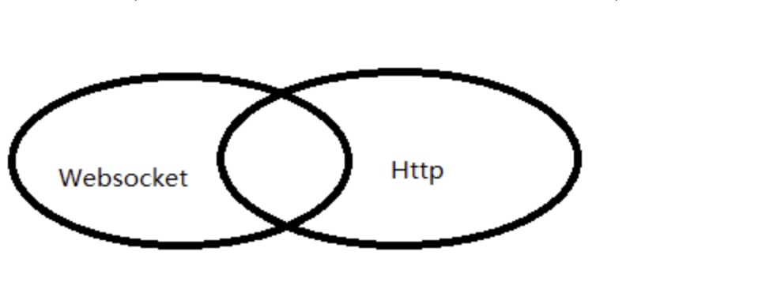

- long poll
long poll 其实原理跟 ajax轮询 差不多，都是采用轮询的方式，不过采取的是阻塞模型（一直打电话，没收到就不挂电话），也就是说，客户端发起请求后，如果没消息，服务端就一直不返回 Response 给客户端，直到有消息了，才返回给客户端，请求才算结束，然后建立新的请求。

- ajax轮询
ajax轮询 的原理非常简单，让浏览器隔个几秒就发送一次请求，询问服务器是否有新信息。

> 从上面可以看出其实这两种方式，都是在不断地建立HTTP连接，然后等待服务端处理，可以体现HTTP协议的另外一个特点，被动性。
> Websocket只用过一次Http请求就可以源源不断的信息传送。

### websocket解决的问题
- 解决了被动性，用websocket可以让服务端主动推送消息给客户端
- 提升了效率，只用一次HTTP握手，所以说整个通讯过程是建立在一次连接/状态中

## 缓存位置
1. Service Worker
	+ 缓存是持续性的
	+ 可以自由选择缓存哪些文件，当缓存没有命中，需要调用fetch方法获取
2. H5 Web Manifest 缓存
3. Memory Cache
	+ 内存中的缓存，读取速度快，但持续性短，随着进程的释放而释放，关闭Tab就消失
	+ 由系统决定哪些文件是丢进内存中缓存，一般是小的且使用率高的
4. Disk Cache
	+ 容量和存储时效性高
	+ 根据 HTTP Header 中的字段判断哪些资源需要缓存，哪些资源可以不请求直接使用，哪些资源已经过期需要重新请求
5. Push Cache
	+ Push Cache 是 HTTP/2 中的内容，当以上三种缓存都没有命中时，它才会被使用
	+ 缓存时间也很短暂，只在会话（Session）中存在，一旦会话结束就被释放
	+ 所有的资源都能被推送，但是 Edge 和 Safari 浏览器兼容性不怎么好
	+ 可以推送 no-cache 和 no-store 的资源
	+ 一旦连接被关闭，Push Cache 就被释放
	+ 多个页面可以使用相同的 HTTP/2 连接，也就是说能使用同样的缓存
	+ Push Cache 中的缓存只能被使用一次
	+ 浏览器可以拒绝接受已经存在的资源推送
	+ 你可以给其他域名推送资源
- 网络请求

## http缓存/浏览器缓存
> 浏览器第一次向一个web服务器发起http请求后，服务器会返回请求的资源，并且在响应头中添加一些有关缓存的字段如：Cache-Control、Expires、Last-Modified、ETag、Date等等, 之后浏览器再向该服务器请求该资源就可以视情况使用强缓存和协商缓存。

### 缓存控制
在http中，控制缓存开关的字段有两个：Pragma 和 Cache-Control。

### Pragma
Pragma有两个字段Pragma和Expires。Pragma的值为no-cache时，表示禁用缓存，Expires的值是一个GMT时间，表示该缓存的有效时间。

### 优先级
Pragma -> Cache-Control -> Expires

### 缓存类型
- 强缓存：浏览器直接从本地缓存中获取数据，不与服务器进行交互;
- 协商缓存：浏览器发送请求到服务器，服务器判定是否可使用本地缓存;
- 联系与区别：两种缓存方式最终使用的都是本地缓存；前者无需与服务器交互，后者需要;

### 强缓存
> 强缓存会触发from disk cache和from memory cache（关闭进程窗口就没了）,先去内存看，如果有，直接加载,如果内存没有，择取硬盘获取，如果有直接加载,如果硬盘也没有，那么就进行网络请求,加载到的资源缓存到硬盘和内存
- 强缓存是利用http的返回头中的Expires或者Cache-Control两个字段来控制的，用来表示资源的缓存时间。
- Cache-Control 可以由多个字段组合而成，（max-age）（s-maxage 同 max-age，覆盖 max-age、Expires，但仅适用于共享缓存，在私有缓存中被忽略。）
- Cache-Control 的优先级更高，max-age 指定一个时间长度，在这个时间段内缓存是有效的，单位是s。
- （public 表明响应可以被任何对象（发送请求的客户端、代理服务器等等）缓存。）
- （private 表明响应只能被单个用户（可能是操作系统用户、浏览器用户）缓存，是非共享的，不能被代理服务器缓存。）
- （no-cache 含义是不使用本地缓存，也就是先与服务器确认缓存是否可用。）
- （no-store 禁止缓存，每次请求都要向服务器重新获取数据。）
- （must-revalidate 指定如果页面是过期的，则去服务器进行获取。）
- [详解](https://blog.csdn.net/u012375924/article/details/82806617)

### 协商缓存
- 协商缓存是利用http的返回头中的ETag或Last-Modified字段来控制的
- ETag和If-None-Match，优先级更高
	+ 强ETag表示形式："22FAA065-2664-4197-9C5E-C92EA03D0A16"。
	+ 弱ETag表现形式：w/"22FAA065-2664-4197-9C5E-C92EA03D0A16"。
- Last-Modified和If-Modified-Since
> 有ETag和Last-Modified字段，下次请求会带上这两个字段，名字分别If-None-Match和If-Modified-Since，吻合，则返回304响应，使用协商缓存。
    
### 启发式缓存
如果Expires, Cache-Control: max-age, 或 Cache-Control:s-maxage 都没有在响应头中出现, 并且也没有其它缓存的设置, 那么浏览器默认会采用一个启发式的算法, RFC建议通常会取响应头的Date_value - Last-Modified_value值的10%作为缓存时间（Chrome，Webkit）。
Firefox是取的（10%和7天的最小值）

> 当 ctrl+f5 强制刷新网页时，直接从服务器加载，跳过强缓存和协商缓存；
> 当 f5 刷新网页时，跳过强缓存，但是会检查协商缓存；

### Date和Age的区别，作用？
作用：可以用来判断缓存是否命中，新鲜度。Date比当前时间老，说明命中缓存

- Date：Date头域表示报文创建的日期，比如请求一个图片，第一次获取到了，是a时间，然后被缓存，刷新当前页面，date仍然为a时
    时间的描述格式由rfc822定义。例如，Date: Mon, 04 Jul 2011 05:53:36 GMT。
- Age： 消息头里包含对象在缓存代理中存贮的时长，以秒为单位。Age的值通常接近于0。表示此对象刚刚从原始服务器获取不久；其他的值则是表示代理服务器当前的系统时间与此应答中的通用头 Date 的值之差。

```html
<!-- 页面禁止缓存的方法 -->
<meta http-equiv="Cache-Control" content="no-cache, no-store, must-revalidate" />
<meta http-equiv="Pragma" content="no-cache" />
<meta http-equiv="Expires" content="0" />
```

### Http 请求和响应的gzip压缩
[gzip压缩详解](https://www.cnblogs.com/LO-ME/p/7377082.html)
- 原理：
    简单来说， Gzip压缩是在一个文本文件中找出类似的字符串， 并临时替换他们，使整个文件变小。
    这种形式的压缩对Web来说非常适合， 因为HTML和CSS文件通常包含大量的重复的字符串，例如空格，标签。

- 优缺点：
    优点是纯文本可以压缩至40%，缺点是增加服务器占用资源，对JPEG压缩不够好。
    
- 使用方式：
    服务器端进行配置，开始gzip，然后请求头增加Accept-Encoding: gzip即可，服务器会对它进行压缩

:::tip
启用方法

通过请求和响应头中增加  
Accept-Encoding: gzip  
Content-Encoding: gzip  
确定客户端或服务器端是否支持压缩  
:::
[一张图解释缓存](https://segmentfault.com/a/1190000015816331)
[图解强缓存和协商缓存](https://www.cnblogs.com/guwufeiyang/p/12868583.html)

## 从浏览器地址栏输入URL后发生了什么?
[参考](https://segmentfault.com/a/1190000006879700?utm_source=sf-related)

### 总体来说分为以下几个过程:
1. DNS解析
2. TCP连接
3. 发送HTTP请求
4. 服务器处理请求并返回HTTP报文,（HTTP1.0返回了数据就会断开TCP连接，Http1.1不会，HTTP1.1的长连接非常easy在空暇后自己主动断开，一般来说这个时间是300s左右。）
5. 浏览器解析渲染页面

### DNS解析
> DNS：域名系统，是一项互联网服务，域名和IP的分布式数据库  
[DNS解析过程](https://www.xuecaijie.com/it/157.html#1Q64p5DeC8dKFF)
> 域名解析的过程是逐级查询的
1. 查找浏览器缓存
2. 查找操作系统缓存
3. 在host文件中查找
4. 查找路由器缓存
5. 查找本地DNS服务器 比如互联网服务提供商（如中国电信），比较著名的 114.114.114.114
6. 查找根DNS服务器
客户端先向本地DNS发请求，然后本地DNS再向根域名发请求，会判别这个域名(.com)是授权给哪台服务器管理,并返回这个顶级DNS服务器(.com DNS)的IP。  
本地DNS收到这台顶级DNS的服务器IP后，会向该服务器发起查询，如果该服务器无法解析，会返回权威DNS服务器的IP地址，即下一级的DNS服务器IP（nicefilm.com），继续查找，直到服务器找到(www.nicefilm.com)的主机，然后返回给本地DNS，再返回到客户端。
> 本地DNS一般是指你电脑上网时IPv4或者IPv6设置中填写的那个DNS。
:::tip
扩展问题：html如何做dns优化？可以通过以下代码预获取DNS。
:::
```html
<meta http-equiv="x-dns-prefetch-control" content="on" />
<link rel="dns-prefetch" href="http://bdimg.share.baidu.com" />
```

### 建立TCP 连接
   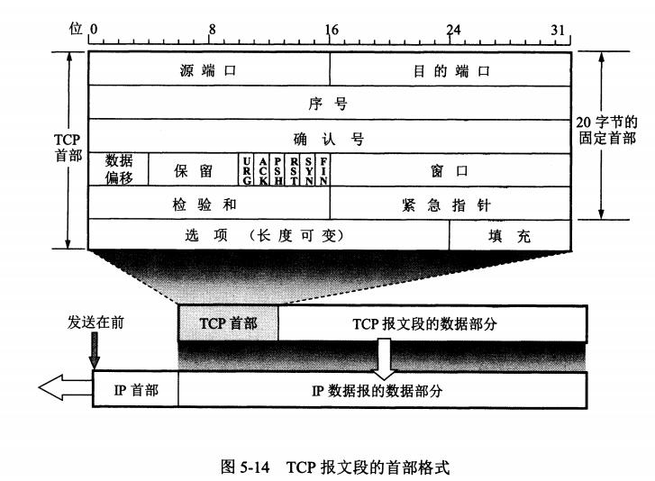
   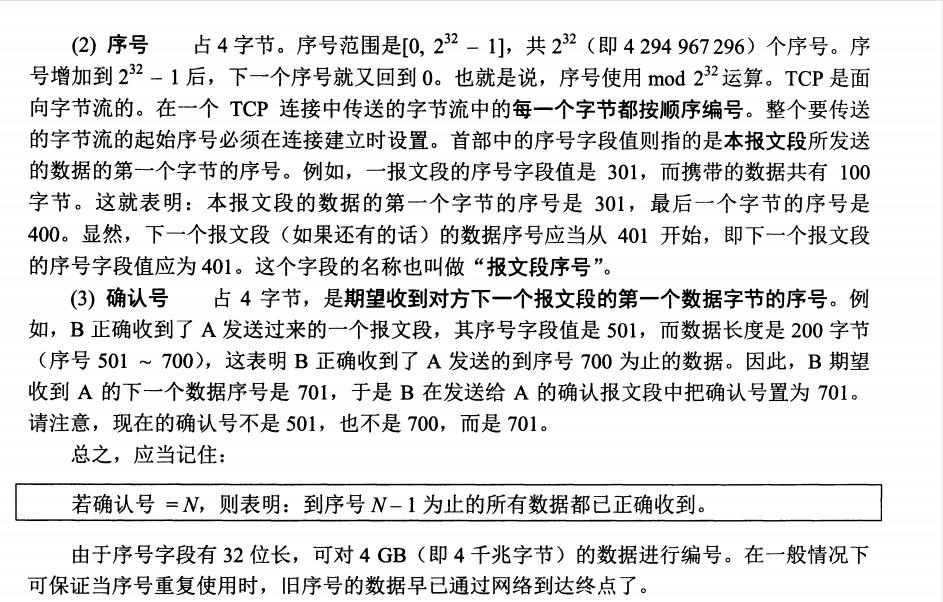
   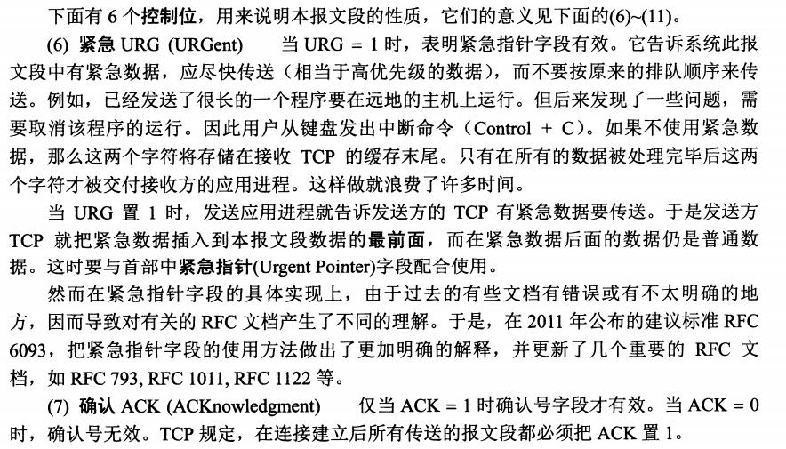
   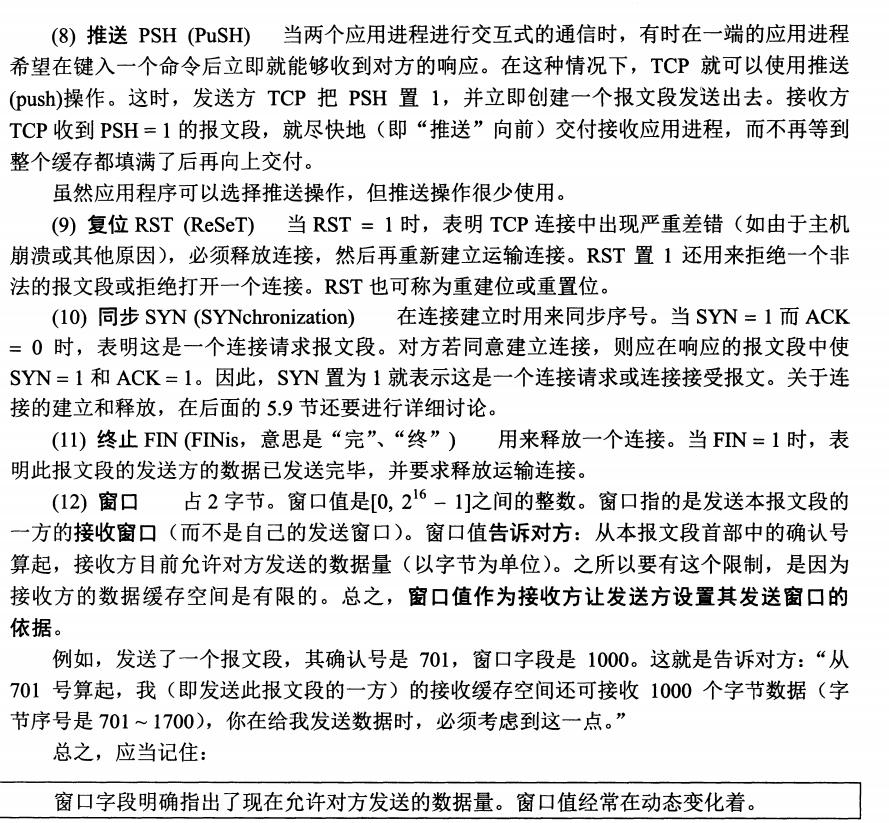
   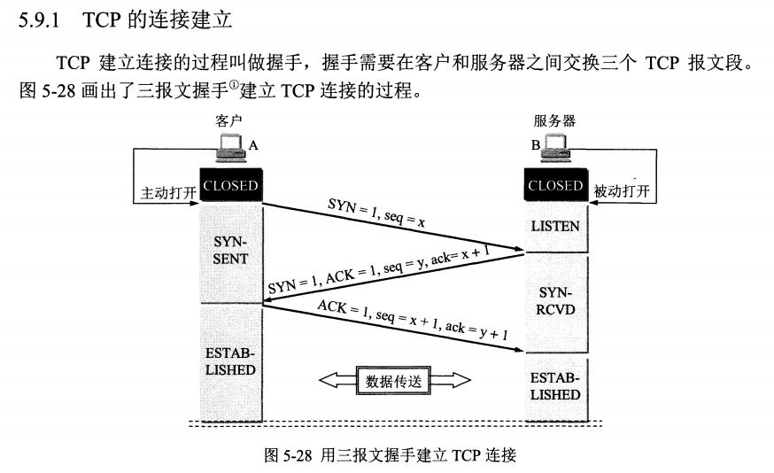
   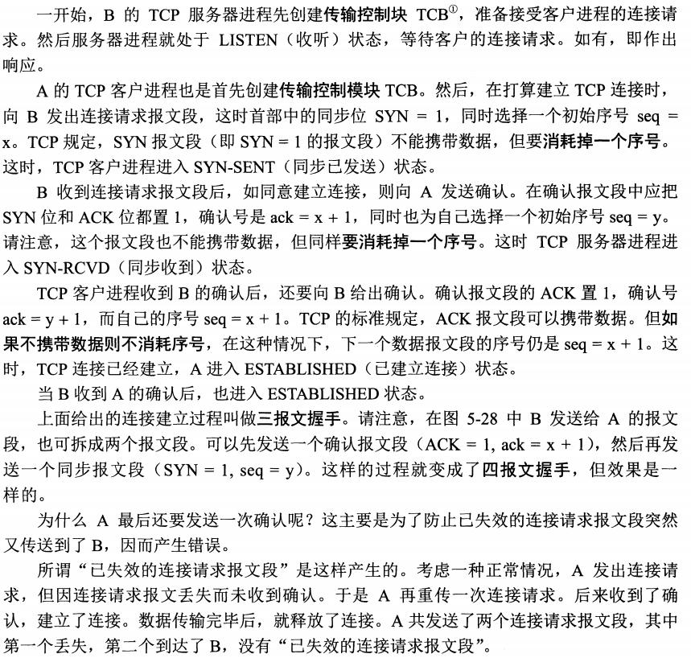
   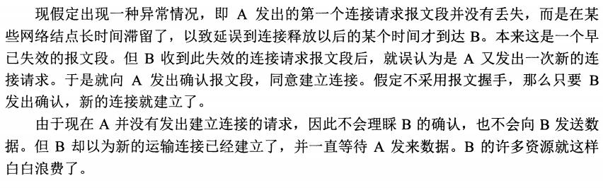

### TCP断开连接，四次握手
   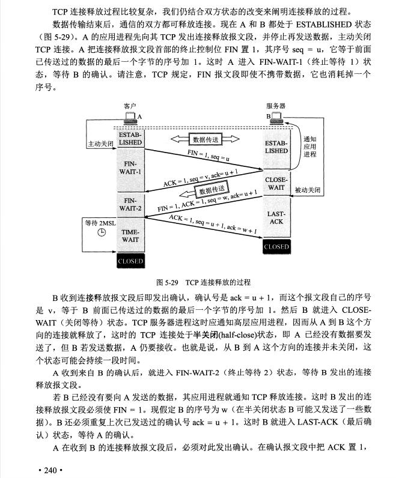
   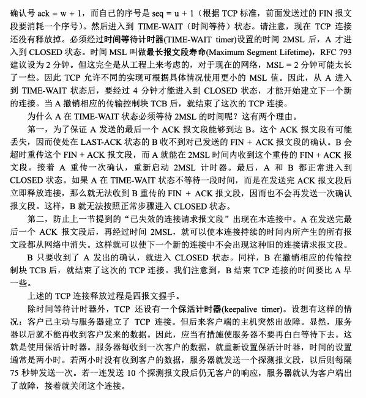

[TCP三次握手，四次挥手详解](https://juejin.cn/post/6919056368250912782)

### 发送HTTP请求
> 有缓存则使用缓存，没有则请求

### 浏览器解析渲染页面
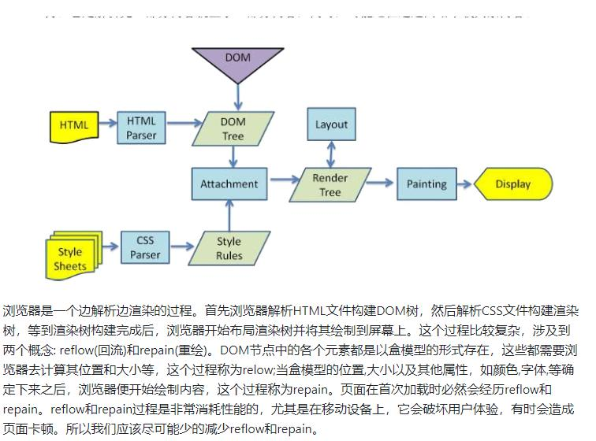
[详细过程参考](https://blog.csdn.net/qq_41807645/article/details/80839757)

1. 先构建DOM树：从上到下解析HTML文档生成DOM节点树（DOM tree），也叫内容树（content tree），遇见script标签和link css标签会开始下载执行，没加异步处理会阻塞渲染和解析，CSS只会阻塞渲染，执行完后再往下解析，所以JS文件不要放到head里，css文件尽量小，JS通过DOM API和CSSOM API来操作DOM树和CSS树；
2. 再构建CSS Rule Tree：加载解析样式生成CSS树；
3. 构建渲染树(render tree)：根据DOM树和CSSOM树,生成渲染树(render tree)；渲染树：按顺序展示在屏幕上的一系列矩形，这些矩形带有字体，颜色和尺寸等视觉属性。渲染树会忽略掉不需要渲染的元素，比如head、display:none的元素等
4. 布局（layout）：根据渲染树将节点树的每一个节点布局在屏幕上的正确位置；
5. 绘制（painting）：遍历渲染树绘制所有节点，为每一个节点适用对应的样式，Native GUI的API绘制;

> 以上步骤并不是一次性顺序完成的。如果DOM或者CSSOM被修改，以上过程会被重复执行。实际上，CSS和JavaScript往往会多次修改DOM或者CSSOM。
:::danger
注意：上述这个过程是理论上是逐步完成的，但是实际实现中为了更好的用户体验，渲染引擎为了尽可能早的将内容呈现到屏幕上，会在构建DOM树的同时去解析CSS构建CSS树，并且还会去生成Rendering Tree。解析完一部分内容就显示一部分内容，同时，可能还在通过网络下载其余内容，这样就可以更快的显示出页面，
:::

 ## 页面渲染优化
 - HTML文档结构层次尽量少，最好不深于六层
 - 脚本尽量后放，放在前即可
 - 少量首屏样式内联放在标签内
 - 样式结构层次尽量简单
 - 在脚本中尽量减少DOM操作，尽量缓存访问DOM的样式信息，避免过度触发回流
 - 减少通过JavaScript代码修改元素样式，尽量使用修改class名方式操作样式或动画
 - 动画尽量使用在绝对定位或固定定位的元素上
 - 隐藏在屏幕外，或在页面滚动时，尽量停止动画
 - 尽量缓存DOM查找，查找器尽量简洁
 - 涉及多域名的网站，可以开启域名预解析

## 页面渲染的大致过程
> 页面依赖外部资源下载是并行的，但是DOM树解析、js执行和首屏渲染却是串行的。理解整个过程，就能明白为什么Head中不要放JS的原因，以及CSS为什么要尽量小。

- 先下载解析HTML并建立DOM树，再解析css绘制渲染树。前者搭建页面结构，后者增添页面样式。而在建立DOM树的过程就会遇到诸如img、外联css和script标签，此时就要加载外部资源了
- 加载资源是由单独的下载线程进行异步加载的，浏览器会并行加载，不过具体并行最大数量是有一定限制的，不同浏览器可能不一样
- 但是加载css和js资源比较特殊，它们的加载会影响页面渲染。css加载不会阻塞DOM树解析，但会阻塞渲染（这是由于渲染依赖于css，如果不等css加载完就渲染的话那么等css加载解析完又得重新渲染，可能又要重绘或者回流）
- 对于js资源的加载，则会阻塞DOM树的构建和渲染，除非设置了script标签的异步属性, 放在head中会在解析DOM树和渲染页面前就加载，并阻塞页面。js正常情况下加载完就会立即执行
- 在js脚本中只能访问当前script 以上的DOM，脚本执行结束后再继续解析DOM
- js执行引擎和页面渲染是由不同的线程来执行，但这两者是互斥的，也就是说js执行过程是无法构建DOM和渲染页面的。这是一种优化机制，由于js可能会对DOM及样式进行修改
- 如果解析js过程中同时构建DOM，就可能造成前后内容不一致或者重复构建。所以应该把script放在body中，使页面更快完成渲染

## URL与URI的区别
URI 是统一资源标识符，而 URL 是统一资源定位符，URL是URI的子集。

## 数据传输过程
[参考文章](https://blog.51cto.com/14557673/2440993)

## 说一下CORS？
CORS是一种新标准，支持同源通信，也支持跨域通信。fetch是实现CORS通信的

## 如何中断ajax请求？
一种是设置超时时间让ajax自动断开，另一种是手动停止ajax请求，其核心是调用XML对象的abort方法，ajax.abort()

## 说一下事件委托？
> 事件委托是指将事件绑定到目标元素的父元素上，利用冒泡机制触发该事件，React的事件机制就使用了事件委托，是合成事件。
```js
ulEl.addEventListener('click', function(e){
    var target = event.target || event.srcElement;
    if(!!target && target.nodeName.toUpperCase() === "LI"){
        console.log(target.innerHTML);
    }
}, false);
```

## target、currentTarget的区别？
- currentTarget当前所绑定事件的元素
- target当前被点击的元素，比如获取Select的value，在onChange回调中使用event.target.value

## OSI 7层模型
- 应用层
- 表示层
- 会话层,
- 传输层(TCP/UDP)
- 网络层(IP,ICMP,IGMP)
- 数据链路层(ARP和RARP(Reverse Address Resolve Protocol)即逆地址解析协议，该协议实现了IP地址和物理地址(MAC地址)之间的转换)
- 物理层(处理数据转电信号)

## TCP/IP协议四层模型
### 网络接口层
- 实现网卡接口的网络驱动，以处理数据在以太网线等物理媒介上的传输
- 网络驱动程序隐藏了不同物理网络的不同电气特性，为上层协议提供一个统一的接口

### 网络层
ARP和RARP(Reverse Address Resolve Protocol)即逆地址解析协议，该协议实现了IP地址和物理地址(MAC地址)之间的转换

### 传输层
### 应用层

## TCP与UDP区别： 
- 连接方面区别
	+ TCP面向连接（如打电话要先拨号建立连接）。
	+ UDP是无连接的，即发送数据之前不需要建立连接。

- 安全方面的区别
	+ TCP提供可靠的服务，通过TCP连接传送的数据，无差错，不丢失，不重复，且按序到达。
	+ UDP尽最大努力交付，即不保证可靠交付。

- 传输效率的区别
	+ TCP传输效率相对较低。
	+ UDP传输效率高，适用于对高速传输和实时性有较高的通信或广播通信。

- 连接对象数量的区别
	+ TCP连接只能是点到点、一对一的。
	+ UDP支持一对一，一对多，多对一和多对多的交互通信。

:::tip
TCP是一个面向连接的、可靠的、基于字节流的传输层协议。
而UDP是一个面向无连接的传输层协议。(就这么简单，其它TCP的特性也就没有了)。
:::

### 具体来分析，和 UDP 相比，TCP 有三大核心特性
1. 面向连接：所谓的连接，指的是客户端和服务器的连接，在双方互相通信之前，TCP 需要三次握手建立连接，而 UDP 没有相应建立连接的过程。
2. 可靠性：TCP 花了非常多的功夫保证连接的可靠，这个可靠性体现在哪些方面呢？一个是有状态，另一个是可控制。TCP 会精准记录哪些数据发送了，哪些数据被对方接收了，哪些没有被接收到，而且保证数据包按序到达，不允许半点差错。这是有状态。当意识到丢包了或者网络环境不佳，TCP 会根据具体情况调整自己的行为，控制自己的发送速度或者重发。这是可控制。相应的，UDP 就是无状态 , 不可控的。
3. 面向字节流：UDP 的数据传输是基于数据报的，这是因为仅仅只是继承了 IP 层的特性，而 TCP 为了维护状态，将一个个 IP 包变成了字节流

## 跨域相关
> 跨域问题来源于浏览器的同源策略，浏览器为了提高网站的安全性
> 同源是指"协议+域名+端口

### 如何解决跨域
1. 通过jsonp跨域，需要服务端配合
```js
var script = document.createElement('script');
script.type = 'text/javascript';
// 传参并指定回调执行函数为onBack
script.src = 'http://www.....:8080/login?user=admin&callback=onBack';
document.head.appendChild(script);
// 回调执行函数
function onBack(res) {
 alert(JSON.stringify(res));
}
```
2. nginx代理跨域
```shell
server {
        listen       80;
        server_name  localhost;
        ## 用户访问 localhost，则反向代理到https://api.shanbay.com
        location / {
            root   html;
            index  index.html index.htm;
            proxy_pass https://api.shanbay.com;//增加这行
        }
}
```
3. 后端在头部信息里面设置安全域名
```php
add_header 'Access-Control-Allow-Origin' *;
```

## 什么是会话cookie,什么是持久cookie?
cookie是服务器返回的，指定了expire time（有效期）的是持久cookie,没有指定的是会话cookie
### 主要属性
- name
- value
- domain
- path
- expires/Max-Age
- Size
- http
- secure