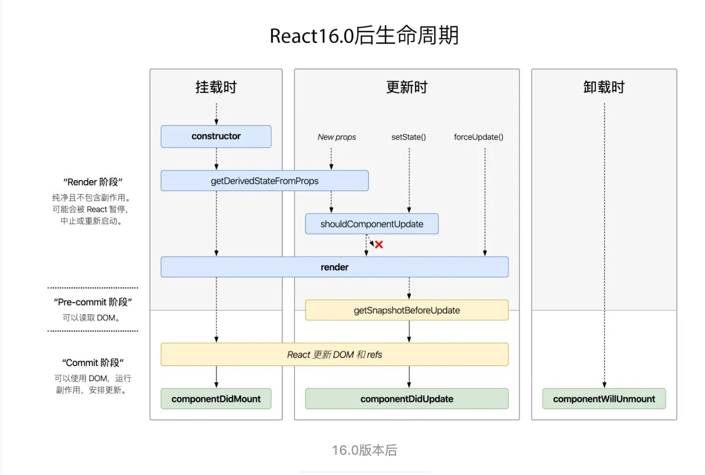

## React 与 Vue 区别
1. 数据响应逻辑不同，vue通过代理/拦截的方式，使得直接改属性值就能更新，而react要手动调用setState。所以vue能直接知道哪些属性发生了变动，所以可以使用watch和computed，进行组件层级的更新。而react则必须从fiberRoot开始diff才能知道，属于整体更新，并且没有设置PURE，SCU，MEMO的话，会更新所有子组件，VUE不会。
2. 模版引擎不同，react是用JSX，vue是用template，类似html语法+自定义指令和属性。比较清晰
3. react中组件的属性是不可变的，每次都是赋新值，而vue是直接改属性值
4. 性能方面，react需要注意使用SCU,pureComponent,memo等减少组件不必要的刷新，如果不设置，父组件更新了，子组件也会跟着更新。而vue则不用担心这些

### 共同点
- 都是MVVM
- 单向数据流
- 组件化开发

## React 调度
:::tip
GUI渲染线程和JS引擎线程是互斥的，如果JS执行占用时间过久，就会阻塞渲染，让用户感到卡顿。所以React 16引入了Fiber
:::

## React 架构分层
### React 15及以前
- Reconciler 层（协调器），负责找出变更的部分
- Renderer 层（更新器），把变化的组件渲染到页面上
- Reconciler 和 Renderer交替执行

### React 16+ 架构分层
- Scheduler(调度器)，负责任务的优先级，高优先级任务优先进入协调器。通过超时检测和自实现requestIdleCallback实现
- Reconciler(协调器)，更新 fiber 
	1. 之前是通过递归处理VDom树，现在改为Fiber链表，把递归流程变更为可中断的循环过程（workloop），每次循环都会判断shouldYield是否还有足够的时间，没时间就等下一次
	2. 为变化的Virtual DOM打上代表增/删/更新的标记，不会立即渲染变更的部分。当所有组件都完成Reconciler的工作，才会统一交给Renderer进行渲染更新。
```js
//副作用Tag
export const Placement = /*             */ 0b0000000000010;  // 插入节点
export const Update = /*                */ 0b0000000000100;  // 更新fiber
export const Deletion = /*              */ 0b0000000001000;  // 删除fiebr
export const Snapshot = /*              */ 0b0000100000000;  // 快照
export const Passive = /*               */ 0b0001000000000;  // useEffect的副作用
export const Callback = /*              */ 0b0000000100000;  // setState的 callback
export const Ref = /*                   */ 0b0000010000000;  // ref
```
- Renderer(更新器)，把变化的组件渲染到页面上

## React 更新的过程，原理
1. 一次更新中，React无法像vue一样直接找到更新范围，要从跟节点开始diff，查找不同，找到不同再更新，当组件很大时，就会阻塞住页面UI。所以React 16 引入 Scheduler 和 Fiber， 让浏览器空闲时处理，优先保障用户体验
2. 所有的更新都是发生在 workInProgress 树上, 更新完之后变成current树，再渲染到页面
3. 通过beginWork 向下调和，由fiberRoot按照child指针逐层向下调和，期间会执行函数组件，实例化类组件，diff调和子节点（复用oldFiber），打上不同effect Tag（类组件的生命周期，或者元素的增加，删除，更新）
4. 通过completeUnitOfWork,向上归并，如果有兄弟节点，返回兄弟，否则返回父节点，一直到fiberRoot，期间形成effectList，对于初始化流程会创建Dom，对Dom进行事件收集。一上一下构成整个fiber树的调和
5. 在commit 阶段， 不需再遍历Fiber，只需执行更新effectList，更新Dom，执行生命周期，获取Ref等

## 模拟requestIdleCallback
- 要满足能让出线程，让浏览器渲染页面，并且一次事件循环只执行一次，所以选择宏任务
- setTimeout ，最小间隔4ms，所以没选择这个
- MessageChannel，解决了这个问题，

## React 渲染原理
1. 组件通过JSX转为React.createElement函数
2. createElement函数主要接收三个参数，元素名称，属性值和子元素，然后生成虚拟Dom，本质是JS对象 --> 再传递给ReactElement生成VDom
3. 通过以上步骤，我们获取到了VDom, 然后react通过diff算法比对更新前后的VDom，找到最小差异，才更新，但是随着组件越来越大，递归更新占用的时间越来越高，会引起页面卡顿，所以引入Fiber
4. ReactDOM.render方法，中调用了legacyRenderSubtreeIntoContainer这个方法
5. 首次构建应用， 创建一个 fiberRoot ，作为整个 React 应用的根基

## rootFiber
通过ReactDom.render渲染出来的，创建的rootFiber, 一个应用可能由多个rootFiber，但只有一个fiberRoot--current-->rootFiber

## 什么是MVVM？和MVC的区别是什么？
- MVVM和MVC都是架构模式
- M代表Model，数据层，负责数据
- V代表View，视图层，用户看到的视图
	+ 展示页面，结构，布局和外观
	+ 接收用户的交互，转发给view model通过数据绑定（事件，回调）
- C代表Control，逻辑层，比较复杂
	+ 响应用户的输入，更新模型层
	+ 从模型拿数据，展示到视图层
- VM代表ViewModel, 视图模型层，它是暴露了公共属性和方法的一个抽象
	+ 与控制层不同，VM有binder，它把view和它在VM中绑定的属性建立了联系，使得视图和VM可以接收和发送更新
	+ 声明式数据
:::tip
View <==> ViewModel <==> Model
:::

### MVVM的优势
有了ViewModel后，可以减少很多重复代码，因为有了Binder，自动把数据更新体现到视图上，也能自动把用户交互传递到VM中


## 生命周期

### 挂载时
- constructor
- static getDerivedStateFromProps（props, state），它应返回一个对象来更新 state
- render
- --------------
- componentDidMount

### 更新时
- static getDerivedStateFromProps(props, state)，它应返回一个对象来更新 state
- shouldComponentUpdate()
- render()
- --------------
- getSnapshotBeforeUpdate(prevProps, prevState)
:::tip
在最近一次渲染输出（提交到 DOM 节点）之前调用。它使得组件能在发生更改之前从 DOM 中捕获一些信息（例如，滚动位置）。此生命周期的任何返回值将作为参数传递给 componentDidUpdate()
:::
- componentDidUpdate(prevProps, prevState, snapshot)

### 卸载
- componentWillUnmount()

### 错误处理
- static getDerivedStateFromError()
- componentDidCatch()


### 不安全的
- UNSAFE_componentWillMount()
- UNSAFE_componentWillUpdate()
- UNSAFE_componentWillReceiveProps()

## Diff算法，为了提升时间复杂度为O(n)
### 启发式算法
- 两个不同类型的元素会产生出不同的树；
- 开发者可以通过设置 key 属性，来告知渲染哪些子元素在不同的渲染下可以保存不变；
- 同层级对比，可以INSERT_MARKUP（插入）、MOVE_EXISTING（移动）和REMOVE_NODE（删除

### 对比不同类型的元素
- 当根节点为不同类型的元素时，React 会拆卸原有的树并且建立起新的树

### 对比同一类型的元素
- 当对比两个相同类型的 React 元素时，React 会保留 DOM 节点，仅比对及更新有改变的属性
- 在处理完当前节点之后，React 继续对子节点进行递归。

### 对比同类型的组件元素
- React 将更新该组件实例的 props 以保证与最新的元素保持一致，并且调用该实例的 UNSAFE_componentWillReceiveProps()、UNSAFE_componentWillUpdate() 以及 componentDidUpdate() 方法
- 下一步，调用 render() 方法，diff 算法将在之前的结果以及新的结果中进行递归

### 对子节点进行递归
- 默认情况下，当递归 DOM 节点的子元素时，React 会同时遍历两个子元素的列表；当产生差异时，生成一个 mutation。如果没有key，会销毁不同元素，然后重建，性能问题
- 有key时，会保留key相同的元素

## React为什么支持跨平台？
因为 React 的设计使得协调和渲染是独立的阶段。协调阶段比较新旧树，计算出差异，修改VDom；渲染阶段把VDom渲染为对应平台，在浏览器中就渲染为Dom结点，移动端就是对应视图。

## React Fiber
> 在处理 UI 时，问题是如果一次执行过多的工作，可能会导致动画掉帧并且看起来不连贯。所以为了解决这个问题，引入Fiber
- Fiber 是 React 16 中新的协调引擎。它的主要目的是使 Virtual DOM 可以进行增量式渲染。
- 其他关键功能包括在新更新到来时暂停、中止或重用工作的能力； 能够为不同类型的更新分配优先级； 和新的并发原语。
- 主要目标是让React能充分利用调度，确定要渲染的优先级，比如，确保用户体验，优先响应用户的点击动画，而不是先响应把请求到的数据渲染出来
- Fiber 是堆栈的重新实现
- 具体而言，Fiber是一个 JavaScript 对象，其中包含有关组件、其输入和输出的信息
- 一条Fiber对应于一个堆栈帧，但它也对应于一个组件的实例

## Fiber 能力
> 为了实现以下功能，我们需要把工作拆分成工作单元，所以从某种意义上来说，一个fiber就代表一个工作单元
- 暂停，恢复工作
- 为不同类型的工作分配优先级
- 重用以前完成的工作
- 如果不再需要，则中止工作

## Fiber重要属性
- type，决定Fiber是关联哪个组件
- key，决定在协调过程中是否会被重用
- child，指向子fiber，描述fiber树结构
- sibling，指向兄弟fiber，描述fiber树结构
- return，指向父fiber
- pendingProps，memoizedProps，用以判断props是否相等，相等就reused
- pendingWorkPriority，Fiber优先级，调度通过这个优先级决定下一个要执行的Fiber
- flush，把Fiber输出到屏幕
- work-in-progress，尚未完成的Fiber，一个组件最多对应两个Fiber，（current, flushed fiber或者work-in-progress）
- host component，React 应用程序的叶节点，Fiber函数的返回值，最终交给Render渲染出来（创建或者更新）
- [参考文章](https://github.com/acdlite/react-fiber-architecture)

## 纯函数
- 输入什么，就输出什么类型
- 没有副作用，不改变输入值

## setState什么时候是同步，异步的？
- 在原生事件回调函数，setTimout回调中是同步的
- 在合成事件中回调是异步的

## setState传对象会合并，batchUpdates
## setState传函数，不会合并

### setState为什么用不可变值
- 直接操作state可能会被setState的batchUpdates覆盖
- 会影响shouldMountUpdate，无法判断是否更新了

### setState可能会合并

## React state
- hooks中setState存在批量更新，在React事件系统函数上下文中存在批量更新，比如点击事件。但是如果在事件回调函数中异步操作setState，异步回调中将打破批量操作，变成同步操作。setState后，继续执行setState后的代码，排队更新
- 批量更新的事件包含Effect mount事件，点击事件，函数组件的执行代码里，全部生命周期事件(应该是)...
```js
const funC = () => {
	const [ number , setNumber ] = React.useState(0)
	if (number === 0) {//批量更新
	    setNumber(1);
	    console.log('qxdlog_number1: ', number);
	
	    setNumber(2);
	    setNumber(4);
	    setNumber(5);
	    setNumber(200);
	    console.log('qxdlog_number2: ', number);
	}
	return <div>{number}</div>;
}
```
- hooks中不同的state的setState也存在批量更新，和上面条一样的
```js
const change = () => {
	setName('李四');
	console.log('set李四之后');
	setSex('女');
	console.log('set女之后');
	//输出set李四之后，set女之后。然后更新函数组件，执行时name和sex都是新值
};
```
- ReactDom.flushSync 可以提高优先级，会打破批量更新，优先更新回调
- ReactDom.unstable_batchedUpdates 可以强制开启批量更新，它回调函数中操作将执行批量更新

## hooks中setState中传入函数与值的区别
- 传入函数，将会获取最新的state进行操作，返回值将作为新的state
```js
setName(state => state + 1);//state是最新的
setName(name + 1);//这个name是老的
```
- 传入值，赋值给state

## hooks中setState传入相同的值是否会更新？
```js
//这种不会更新
const [ state  , dispatchState ] = useState({ name:'alien' })
const  handleClick = ()=>{ // 点击按钮，视图没有更新。
	state.name = 'Alien'
	dispatchState(state) // 直接改变 `state`，在内存中指向的地址相同。
}

//这种直接放在函数组件代码里的，会更新，而且如果不加if，会报错，re-render次数超过限制
if (state.name !== 'Alien') {
	state.name = 'Alien'
	dispatchState(state) // 直接改变 `state`，在内存中指向的地址相同。
}
```


## React.memo与PureComponent
- React.memo检查 props 变更，用作函数组件性能优化，可以传入第二个参数(第二个参数是一个函数，接收preProps,newProps, 类似SCU控制更新，但是返回true代表相同，不更新)
> 如果你的组件在相同 props 的情况下渲染相同的结果，那么你可以通过将其包装在 React.memo 中调用
- React.PureComponent 中以浅层对比 prop 和 state 的方式来实现了该函数,shouldComponentUpdate

## shouldComponentUpdate
- 默认值是true,要更新
- 接收两个参数，nextProps, nextState
- 父组件更新，如果子组件没设置SCU相关的，哪怕没有数据关联，子组件也会更新

### 为什么React不把shouldComponentUpdate直接实现，每次都比较，而是默认返回true
- 如果默认实现，有些人在更改state时是直接改，比如数组用push,pop，然后再setState那个数组，会导致无法更新，因为新旧state的地址相同
- 如果每次都深比较，当数据层次很深时，可能导致性能问题

## React事件
> React中的事件是合成事件，synthetic事件，如果更新了函数组件，会把新的回调函数传给事件，不会重复绑定

## React中事件回调函数为什么bind this?
不绑定this，这个this默认是undefined
- 可以使用定义静态方法的形势，这样就不用绑定this
```js
class {
    callback = () => {
        
    }
}
```

## React拖拽
> 函数组件和类组件一样的效果，之前不行是因为事件和state更新理解不到位，还有就是move事件范围
```js
class App extends React.Component {
    state = {
        mouseStartLeft: 0,
        mouseStartTop: 0,
        targetLeft: 0,
        targetTop: 0,
        isDown: false,
        posLeft: 0,
        posTop: 0
    }

    handleMouseDown = (e) => {
        this.setState({
            isDown: true,
            mouseStartLeft: e.clientX,
            mouseStartTop: e.clientY,
            targetLeft: e.target.offsetLeft,
            targetTop: e.target.offsetTop
        });
    }

    handleMouseMove = (e) => {
        if (this.state.isDown) {
            this.setState((state) => {
                return {
                    posLeft: e.clientX - state.mouseStartLeft + state.targetLeft,
                    posTop: e.clientY - state.mouseStartTop + state.targetTop
                }
            });
        }
    }

    handleMouseUp = (e) => {
        this.setState({
            isDown: false
        })
    }

    render() {
        return <div style={{
            width: '100vw',
            height: '100vh',
            backgroundColor: '#eee'
        }}
        onMouseMove={this.handleMouseMove}
        >
            <div
                style={{
                    width: 100,
                    height: 100,
                    backgroundColor: 'skyblue',
                    cursor: 'pointer',
                    position: 'absolute',
                    left: this.state.posLeft,
                    top: this.state.posTop
                }}
                onMouseDown={this.handleMouseDown}
                onMouseUp={this.handleMouseUp}
            ></div>
        </div>
    }
}
```

## hook是为了解决什么问题？
> Hook 是一些可以让你在函数组件里“钩入” React state 及生命周期等特性的函数！Hook 使你在非 class 的情况下可以使用更多的 React 特性。
- 在组件之间复用状态逻辑很难（代码复用问题）
	+ Hook 使你在无需修改组件结构的情况下复用状态逻辑，参考自定义hook
	+ 自定义hook就是自己创建的 Hook， 用来复用不同组件之间的状态逻辑
- 复杂组件变得难以理解（代码管理问题）
	+ 就是说组件复杂时，类的生命周期中可能充满不相关的状态逻辑，比如请求数据和事件监听等，比较混乱
	+ Hook 将组件中相互关联的部分拆分成更小的函数（比如设置订阅或请求数据），而并非强制按照生命周期划分，参考Effect Hook
- 难以理解的 class（class的this问题，处理函数的this有冗余代码，和难以理解）
	+ class 不能很好的压缩，并且会使热重载出现不稳定
	+ 为了以后组件能预编译

## 常见内置hook
- State Hook，用来给组件添加一些内部 state，在重复渲染时保留这个 state。与class中this.setState区别，this.setState会合并，而hook是替换
> 要保证调用顺序是不变
```js
function ExampleWithManyStates() {
  // 声明多个 state 变量！
  const [age, setAge] = useState(42);
  const [fruit, setFruit] = useState(() => 'banana');
  const [todos, setTodos] = useState([{ text: 'Learn Hooks' }]);
  // ...
}
```
- Effect Hook
	+ useEffect 就是一个 Effect Hook，给函数组件增加了操作副作用的能力
	+ useEffect与class 组件中的 componentDidMount、componentDidUpdate 和 componentWillUnmount 具有相同的用途，只不过被合并成了一个 API
	+ 通过使用 Hook，你可以把组件内相关的副作用组织在一起（例如创建订阅及取消订阅），而不要把它们拆分到不同的生命周期函数里
	+ 当你调用 useEffect 时，就是在告诉 React 在完成对 DOM 的更改后运行你的“副作用”函数
> React 组件中执行过数据获取、订阅或者手动修改过 DOM。我们统一把这些操作称为“副作用”，或者简称为“作用”。因为它们会影响其它组件并且在渲染期间无法完成
```js
  //不传第二个参数，就等于componentDidMount和componentDidUpdate
  useEffect(() => {
	  //componentDidMount
    ChatAPI.subscribeToFriendStatus(props.friend.id, handleStatusChange);
	
    return () => {//componentWillUnmount
      ChatAPI.unsubscribeFromFriendStatus(props.friend.id, handleStatusChange);
    };
  });
```

## useEffect与componentDidUpdate和componentDidMount的区别
- 与 componentDidMount、componentDidUpdate 不同的是，在浏览器完成布局与绘制之后，传给 useEffect 的函数会延迟调用。这使得它适用于许多常见的副作用场景，比如设置订阅和事件处理等情况，因此不应在函数中执行阻塞浏览器更新屏幕的操作。
- 然而，并非所有 effect 都可以被延迟执行。例如，在浏览器执行下一次绘制前，用户可见的 DOM 变更就必须同步执行，这样用户才不会感觉到视觉上的不一致。（概念上类似于被动监听事件和主动监听事件的区别。）React 为此提供了一个额外的 useLayoutEffect Hook 来处理这类 effect。
- 虽然 useEffect 会在浏览器绘制后延迟执行，但会保证在任何新的渲染前执行。React 将在组件更新前刷新上一轮渲染的 effect。

## 函数组件渲染阶段
> 在函数组件主体内（这里指在 React 渲染阶段）改变 DOM、添加订阅、设置定时器、记录日志以及执行其他包含副作用的操作都是不被允许的，因为这可能会产生莫名其妙的 bug 并破坏 UI 的一致性。

## Hook 使用规则
> Hook 就是 JavaScript 函数，但是使用它们会有两个额外的规则：
- 只能在函数最外层调用 Hook。不要在循环、条件判断或者子函数中调用
- 只能在 React 的函数组件中和自定义hook中调用 Hook。不要在其他 JavaScript 函数中调用

## 自定义 Hook
> 是为了能在组件之间重用一些状态逻辑，hook之前是通过高阶组件和 render props实现，但是会改代码结构，自定义 Hook 可以让你在不增加组件的情况下达到同样的目的
### 自定义hook例子
```js
import React, { useState, useEffect } from 'react';

//好友状态自定义hook，可以在不同组件中复用。这就是一个状态逻辑
function useFriendStatus(friendID) {
  const [isOnline, setIsOnline] = useState(null);//状态值

  function handleStatusChange(status) {
    setIsOnline(status.isOnline);
  }

  useEffect(() => {
    ChatAPI.subscribeToFriendStatus(friendID, handleStatusChange);//逻辑
    return () => {
      ChatAPI.unsubscribeFromFriendStatus(friendID, handleStatusChange);//逻辑
    };
  });

  return isOnline;
}
```
### 自定义hook复用的是状态逻辑，而不是状态
 Hook 的每次调用都有一个完全独立的 state —— 因此你可以在单个组件中多次调用同一个自定义 Hook。
 
 ### 特点
 - 自定义 Hook 更像是一种约定而不是功能。如果函数的名字以 “use” 开头并调用其他 Hook，我们就说这是一个自定义 Hook
 - 你可以创建涵盖各种场景的自定义 Hook，如表单处理、动画、订阅声明、计时器

### 其它hooks
- useContext，不使用组件嵌套就可以订阅 React 的 Context
> 接收一个 context 对象（React.createContext 的返回值）并返回该 context 的当前值。当前的 context 值由上层组件中距离当前组件最近的 <MyContext.Provider> 的 value prop 决定。  
> 当组件上层最近的 <MyContext.Provider> 更新时，该 Hook 会触发重渲染，并使用最新传递给 MyContext provider 的 context value 值。即使祖先使用 React.memo 或 shouldComponentUpdate，也会在组件本身使用 useContext 时重新渲染。
```js
function Example() {
  const locale = useContext(LocaleContext);
  const theme = useContext(ThemeContext);
  // ...
}
```
- useReducer，可以通过 reducer 来管理组件本地的复杂 state, state 逻辑较复杂且包含多个子值，或者下一个 state 依赖于之前的 state 等 比 useState 更适合。
> 接收一个形如 (state, action) => newState 的 reducer
```js
const initialState = {count: 0};

function reducer(state, action) {
  switch (action.type) {
    case 'increment':
      return {count: state.count + 1};
    case 'decrement':
      return {count: state.count - 1};
    default:
      throw new Error();
  }
}

function Counter() {
  const [state, dispatch] = useReducer(reducer, initialState);
  return (
    <>
      Count: {state.count}
      <button onClick={() => dispatch({type: 'decrement'})}>-</button>
      <button onClick={() => dispatch({type: 'increment'})}>+</button>
    </>
  );
}
```
- useCallback，返回一个 memoized 回调函数
> useCallback(fn, deps) 相当于 useMemo(() => fn, deps)
- useMemo, 把“创建”函数和依赖项数组作为参数传入 useMemo，它仅会在某个依赖项改变时才重新计算 memoized 值
```js
const memoizedValue = useMemo(() => computeExpensiveValue(a, b), [a, b]);
```
- useRef,不仅可以用在dom元素和组件上。还可以用作可变且可以容纳任意值的通用容器，类似于一个 class 的实例属性
- useImperativeHandle，暴露给父组件的属性
```js
function FancyInput(props, ref) {
  const inputRef = useRef();
  useImperativeHandle(ref, () => ({
    focus: () => {
      inputRef.current.focus();
    }
  }));
  return <input ref={inputRef} ... />;
}
FancyInput = forwardRef(FancyInput);
```
- useLayoutEffect,其函数签名与 useEffect 相同，但它会在所有的 DOM 变更之后同步调用 effect,可以使用它来读取 DOM 布局并同步触发重渲染
- useDebugValue,可用于在 React 开发者工具中显示自定义 hook 的标签

## Ref的使用
### 获取Dom或者子组件实例的方式
- ref传入字符串，可以通过this.refs获取对应的
- ref传入函数，可以通过函数参数获取实例
- ref传入变量，通过ref.current获取

### forwardRef
解决ref不能跨层级捕获和传递的问题

### 父子通信
通过ref获取组件实例，调用对应方法

## 组件通信的方法
- props，父传子，子传父调用父方法
- bus通信
- redux，复杂的公共信息，用户管理
- ref
- Context，主题色，多语言

## 什么时候会用到React.createPortal
在使用固定定位，或者弹窗的时候，需要把组件放到最外层（UC浏览器需要），此时需要用到React.createPortal把Dom渲染到外层Dom下
- 父容器是BFC时
- 固定定位
- zIndex太小时

## React异步组件
- const SomeComponent = React.lazy(() => import('./SomeComponent'));
- React.Suspense
```js
// 该组件是动态加载的
const OtherComponent = React.lazy(() => import('./OtherComponent'));

function MyComponent() {
  return (
    // 显示 <Spinner> 组件直至 OtherComponent 加载完成
    <React.Suspense fallback={<Spinner />}>
      <div>
        <OtherComponent />
      </div>
    </React.Suspense>
  );
}
```

## Redux
- store state
- reducer
- action，异步action
- dispatch
- subscribe 接收更新
- 单向数据流

### react-redux
- Provider <Provider store={Provider}>
- connect Com = connect(mapStateToProps, mapDispatchToProps)(Com)
- mapStateToProps
- mapDispatchToProps

### 异步action
- 需要引入redux-thunx
- redux中间件的中间指的就是action和store之间
- redux-thunk就是对dispatch做了一个升级，之前dispatch只能派发对象，升级之后传递对象和函数都可以
- [参考](https://blog.csdn.net/qq_40319394/article/details/105204096)
```js
const store = createStore(rducer, applyMiddleware(thunk, logger));
return (dispatch) => {
	fetch(url).then(res => {
		dispatch(addToDo(res.text))
	})
}
```

## React-Router
### 懒加载
```js
const Com = React.lazy(() => import('../../Com'));
<React.Suspence fallback={<Loading />}>
	<Route path="/" component={Com}/>
</React.Suspence>
```