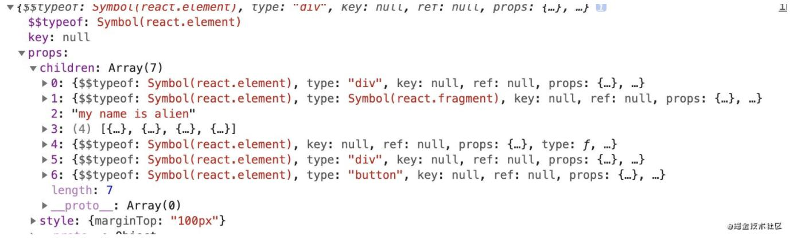

## JSX是什么？
1. JSX是一个形如HTML标签的JS语法扩展，是React.createElement函数的语法糖
2. 通过使用JSX可以生成**React元素**，用来描述用户界面
3. 本质是一个JS对象，因为JSX会被Babel编译成React.createElement()，React.createElement()会返回一个ReactElement的JS对象
```jsx
//JSX两种形式
let jsxOne = <Test></Test>;
let jsxTwo = <Test2/>;
```

## JSX的使用
1. 可以在JSX中嵌入表达式
2. JSX可以用作表达式
3. 通过小驼峰方式给JSX标签添加属性，属性值可以是字符串或者变量
4. 可以给JSX添加子元素
5. JSX 可以防止注入攻击，在渲染输入内容前会进行转义，可以有效防止XSS攻击
6. 使用JSX需要导入React

## 为什么使用JSX？
JSX语法糖允许前端开发者使用我们最熟悉的类HTML标签语法来创建虚拟DOM在降低学习成本的同时，
也提升了研发效率与研发体验。

## 自定义组件为什么必须用大写，html组件为什么用小写
以小写字母开头的元素代表一个 HTML 内置组件，比如 div 或者 span 标签 会生成相应的字符串 'div' 或者 'span' 传递给 React.createElement（作为参数）。大写字母开头的元素则对应着在 JavaScript 引入或自定义的组件，如 <Foo /> 会编译为 React.createElement(Foo)。

我们建议使用大写字母开头命名自定义组件。如果你确实需要一个以小写字母开头的组件，则在 JSX 中使用它之前，必须将它赋值给一个大写字母开头的变量。

## 如果你没给 prop 赋值，它的默认值是 true。以下两个 JSX 表达式是等价的：
```jsx
<MyTextBox autocomplete />

<MyTextBox autocomplete={true} />
```

## 字符串字面量。当你将字符串字面量赋值给 prop 时，它的值是未转义的。以下两个 JSX 表达式是等价的：
```jsx
<MyComponent message="&lt;3" />

<MyComponent message={'<3'} />
```

## 属性展开
如果你已经有了一个 props 对象，你可以使用展开运算符 ... 来在 JSX 中传递整个 props 对象。以下两个组件是等价的：
```jsx
function App1() {
  return <Greeting firstName="Ben" lastName="Hector" />;
}

function App2() {
  const props = {firstName: 'Ben', lastName: 'Hector'};
  return <Greeting {...props} />;
}
```

## JSX子元素
JSX 会移除行首尾的空格以及空行。与标签相邻的空行均会被删除，文本字符串之间的新行会被压缩为一个空格。因此以下的几种方式都是等价的：
```jsx
<div>Hello World</div>

<div>
  Hello World
</div>

<div>
  Hello
  World
</div>

<div>

  Hello World
</div>
```

## JSX 子元素
子元素允许由多个 JSX 元素组成。
```jsx
<MyContainer>
  <MyFirstComponent />
  <MySecondComponent />
</MyContainer>
```

## React 组件也能够返回存储在数组中的一组元素：
```jsx
render() {
  // 不需要用额外的元素包裹列表元素！
  return [
    // 不要忘记设置 key :)
    <li key="A">First item</li>,
    <li key="B">Second item</li>,
    <li key="C">Third item</li>,
  ];
}
```

## JavaScript 表达式作为子元素
JavaScript 表达式可以被包裹在 {} 中作为子元素。例如，以下表达式是等价的：
```jsx
<MyComponent>foo</MyComponent>

<MyComponent>{'foo'}</MyComponent>
```

## 函数作为子元素
通常，JSX 中的 JavaScript 表达式将会被计算为字符串、React 元素或者是列表。不过，props.children 和其他 prop 一样，它可以传递任意类型的数据，而不仅仅是 React 已知的可渲染类型。例如，如果你有一个自定义组件，你可以把回调函数作为 props.children 进行传递：
```jsx
// 调用子元素回调 numTimes 次，来重复生成组件
function Repeat(props) {
  let items = [];
  for (let i = 0; i < props.numTimes; i++) {
    items.push(props.children(i));
  }
  return <div>{items}</div>;
}

function ListOfTenThings() {
  return (
    <Repeat numTimes={10}>
      {(index) => <div key={index}>This is item {index} in the list</div>}
    </Repeat>
  );
}
```

## 布尔类型、Null 以及 Undefined 将会忽略
:::tip
false, null, undefined, and true 是合法的子元素。但它们并不会被渲染。以下的 JSX 表达式渲染结果相同：
:::
```jsx
<div />

<div></div>

<div>{false}</div>

<div>{null}</div>

<div>{undefined}</div>

<div>{true}</div>
```
:::tip
值得注意的是有一些 “falsy” 值，如数字 0，仍然会被 React 渲染。例如，以下代码并不会像你预期那样工作，因为当 props.messages 是空数组时，0 仍然会被渲染：
:::
```jsx
<div>
  {props.messages.length &&
    <MessageList messages={props.messages} />
  }
</div>
```

要解决这个问题，确保 && 之前的表达式总是布尔值：
```jsx
<div>
  {props.messages.length > 0 &&
    <MessageList messages={props.messages} />
  }
</div>
```

反之，如果你想渲染 false、true、null、undefined 等值，你需要先将它们转换为字符串：
```jsx
<div>
  My JavaScript variable is {String(myVariable)}.
</div>
```
  
## JSX元素节点类型？
- element 元素类型
- fragment 类型
- text 文本类型
- 数组节点类型
- 组件类型
- 三元运算
- 函数执行

## JSX经过babel处理之后会变成什么？
	会变成React Element形式，React Element由React.createElement函数生成。
	语法如下：
```js
React.createElement(
  type,//React组件或字符串'div'这种
  [props],//一个对象，在 dom 类型中为标签属性
  [...children] //子节点
)

//eg:
const reactElement = React.createElement(
  'h1',
  {className: 'greeting'},
  'Hello, world!'
);
```

## createElement 处理后的样子


## React 底层调和处理后，终将变成什么？
最终，在调和阶段，上述 React element 对象的每一个子节点都会形成一个与之对应的 fiber 对象，
然后通过 sibling、return、child 将每一个 fiber 对象联系起来。

## Fiber Tag 种类
```js
export const FunctionComponent = 0;       // 函数组件
export const ClassComponent = 1;          // 类组件
export const IndeterminateComponent = 2;  // 初始化的时候不知道是函数组件还是类组件 
export const HostRoot = 3;                // Root Fiber 可以理解为跟元素 ， 通过reactDom.render()产生的根元素
export const HostPortal = 4;              // 对应  ReactDOM.createPortal 产生的 Portal 
export const HostComponent = 5;           // dom 元素 比如 <div>
export const HostText = 6;                // 文本节点
export const Fragment = 7;                // 对应 <React.Fragment> 
export const Mode = 8;                    // 对应 <React.StrictMode>   
export const ContextConsumer = 9;         // 对应 <Context.Consumer>
export const ContextProvider = 10;        // 对应 <Context.Provider>
export const ForwardRef = 11;             // 对应 React.ForwardRef
export const Profiler = 12;               // 对应 <Profiler/ >
export const SuspenseComponent = 13;      // 对应 <Suspense>
export const MemoComponent = 14;          // 对应 React.memo 返回的组件
```
fiber 对应关系

child： 一个由父级 fiber 指向子级 fiber 的指针。
return：一个子级 fiber 指向父级 fiber 的指针。
sibiling: 一个 fiber 指向下一个兄弟 fiber 的指针。