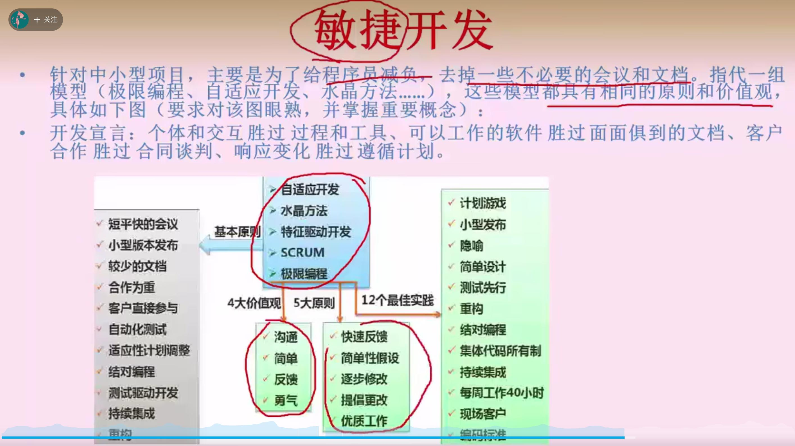
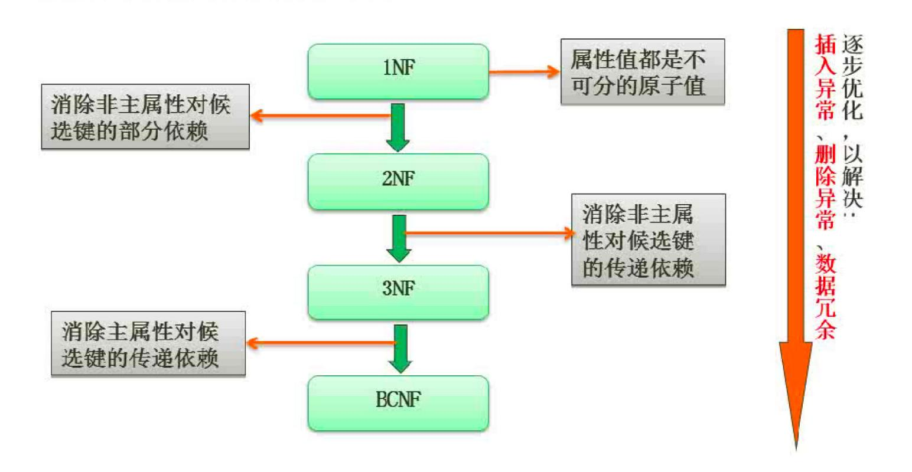

## 能力成熟度模型
1. 初始级，杂乱无章，混乱，没有明确步骤，项目靠个人
2. 可重复级，建立了基本的项目管理过程和实践
3. 已定义级，管理和工程都已经标准化，文档化
4. 已管理级，制定了软件过程和产品质量的详细标准
5. 优化级，加强了定量分析

## UP
### 四大阶段
1. 初始
2. 精化
3. 构建
4. 移交

## 软件过程模型
### 瀑布模型（SDLC）
> 一步一步执行，像瀑布一样，只适用于需求稳定，明确

### V模型，瀑布模型的变体，增加了多轮测试

### 演化模型，快速原型开发
> 需求不明确的情况，先弄个基础的版本，再根据客户需求不断迭代

### 螺旋模型，适合大型项目
> 多个模型的混合，也是原型，但是增加了风险分析

### 增量模型
> 首先开发核心模块儿，再开发次核心模块儿。与原型模型的区别，每一次增量都可作为独立可操作的产品，原型构造一般是为了演示

### 喷泉模型，面向对象，迭代性和无间歇性
### 基于构件的开发模型CBSD，增强了复用性，可靠性
### 形式化方法模型，建立在数学上


## 软件开发方法
### 结构化方法，瀑布模型，一旦开发完成，将难以修改，不利于复用及后续版本的开发，被面向对象替代
### jackson方法，面向数据结构的方法，小规模项目
### 原型方法，适用于需求不明确
### 面向对象方法，强调复用性，构建全面合理的模型

## 敏捷开发
### 针对小型项目，给程序员减负，一切以开发出项目为主
- 
### 结对编程，一个程序员开发，一个程序观察审查
### 极限编程
### 并列争球，30天一冲刺

## 数据库范式
1. 第一范式（1NF） 在任何一个关系数据库中，第一范式（1NF）是对关系模式的基本要求，不满足第一范式（1NF）的数据库就不是关系数据库。 所谓第一范式（1NF）是指数据库表的每一列都是不可分割的基本数据项，同一列中不能有多个值，即实体中的某个属性不能有多个值或者不能有重复的属性。如果出现重复的属性，就可能需要定义一个新的实体，新的实体由重复的属性构成，新实体与原实体之间为一对多关系。在第一范式（1NF）中表的每一行只包含一个实例的信息。 
2. 第二范式（2NF） 第二范式（2NF）是在第一范式（1NF）的基础上建立起来的，即满足第二范式（2NF）必须先满足第一范式（1NF）。第二范式（2NF）要求数据库表中的每个实例或行必须可以被惟一地区分。为实现区分通常需要为表加上一个列，以存储各个实例的惟一标识。 第二范式（2NF）要求实体的属性完全依赖于主关键字。所谓完全依赖是指不能存在仅依赖主关键字一部分的属性，如果存在，那么这个属性和主关键字的这一部分应该分离出来形成一个新的实体，新实体与原实体之间是一对多的关系。为实现区分通常需要为表加上一个列，以存储各个实例的惟一标识。简而言之，第二范式就是非主属性非部分依赖于主关键字。 
3. 第三范式（3NF） 满足第三范式（3NF）必须先满足第二范式（2NF）。简而言之，第三范式（3NF）要求一个数据库表中不包含已在其它表中已包含的非主关键字信息。例如，存在一个部门信息表，其中每个部门有部门编号（dept_id）、部门名称、部门简介等信息。那么员工信息表中列出部门编号后就不能再将部门名称、部门简介等与部门有关的信息再加入员工信息表中。如果不存在部门信息表，则根据第三范式（3NF）也应该构建它，否则就会有大量的数据冗余。简而言之，第三范式就是属性不依赖于其它非主属性。【可能存在非主属性决定其它属性】
4. BC范式，满足第二范式，和第三范式区别：【不能存在非主属性决定其它属性】
5. 第四范式：限制关系模式间不能存在非平凡且非函数依赖的多值依赖，要求把同一表内多对多关系删除
6. 主属性：候选键内属性，其它属性为非主属性，所有属性都是主属性的话，就是第三范式
7. 

### 函数依赖
- 部分函数依赖
```js
A -> C, (A, B) -> C
```
- 传递函数依赖

### 非规范化会出现以下问题
- 数据冗余
- 插入，更新，删除异常  

### 键和约束
- 超键，唯一标识此表的属性组合
- 候选键，超键中去除冗余属性
- 主键，任选一个候选键
- 外键，其它表中的主键
- 实体完整性约束，主键约束，主键不能为空
- 参照完整性约束，外键约束，外键必须是其它表的主键或者为空


## 随机存储，内容存储
- 本题考查存储系统的基础知识。
- 存储系统中的存储器，按访问方式可分为按地址访问的存储器和按内容访问的存储器；按寻址方式分类可分为随机存储器、顺序存储器和直接存储器。随机存储器(Random Access Memory, RAM)指可对任何存储单元存入或读取数据， 访问任何一个存储单元所需的时间是相同的。顺序存储器(Sequentially Addressed Memory, SAM)指访问数据所需要的时间与数据所在的存储位置相关，磁带是典型的顺序存储器。直接存储器(Direct Addressed Memory，DAM)是介于随机存取和顺序存取之间的一种寻址方式。磁盘是一种直接存取存储器，它对磁道的寻址是随机的，而在一个磁道内，则是顺序寻址。相联存储器是一种按内容访问的存储器。其工作原理就是把数据或数据的某一部分作为关键字，将该关键字与存储器中的每一单元进行比较，从而找出存储器中所有与关键字相同的数据字。

## 必考题
### UML图形
记住每种符号的含义，泛化之类的
- [UML图详解](https://blog.csdn.net/qq_35423190/article/details/125069834)

### 关键路径
### 设计模式
记住设计模式大概的应用场景和特点，最好能看看设计模式的类图

### PV同步互斥
### 可靠性
### 软件工程
记住每种模型大致的场景，比如瀑布模型适用于需求明确，螺旋模型适用于大项目

### 流水线，磁盘寻址时间
### 直接地址，一级地址，二级地址
### 上下文无关表示
- 排除没有的符号，比如括号（，除/
- 有限自动机，明白图的意思