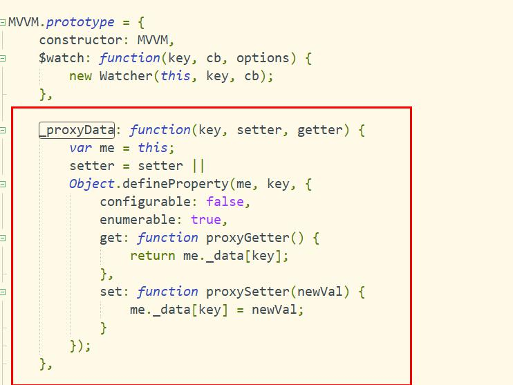

## Chrome调试Vue源码
1. 断点加在语句上
2. 四个按钮，第一个恢复执行，第二个执行完当前语句，第三个进入函数，第四个执行完函数

## Vue
### Vue源码
1. 数据代理，核心是利用Object.defineProperty实现
```js
let vm = new Vue({
    data: {
        name: 'Mike'
    }
});

//其中vm代理了vm._data, vm.name === vm._data.name
```


2. 模板解析，把获取el节点，appendChild到DocumentFragment（内存）中，递归所有子节点，把文本节点中{{}}和元素节点的属性（事件属性绑定事件，bind(vm)，其它属性）,替换为vm中对应属性，显示出来，给每个变量new Watcher，添加Dep

3. 数据绑定, 一旦更新了data中的某个属性数据, 所有界面上直接使用或间接使用了此属性的节点都会更新(更新)

4. 数据劫持，是实现数据绑定的技术
- vm中set是实现数据代理的，vm中data的set是实现数据劫持的
- 遍历vm中所有属性节点，设置set，改变时，Dep调用notify方法，执行Watcher，触发视图更新
- Watcher是观察的Html中 name, user.id,和指令中的变量，当对应变量变化时，更新视图
- Dep是负责通知和监听

### Vue生命周期
1. beforeCreate
2. created(实例创建完成，可以请求数据给this)
3. beforeMount
4. mounted(DOM完成，可以操作DOM)
5. beforeUpdate
6. updated
7. beforeDestory
7. destory
8. activated //被 keep-alive 缓存的组件激活时调用
9. deactivated //被 keep-alive 缓存的组件停用时调用

## is属性
```html
  <tr is="mytr"></tr>
  <tr is="mytr"></tr>
  
  Vue.component('mytr', {
    template: '<tr><td>Hell</td></tr>'
  });
```

## v-show 与 v-if 有什么区别？
- v-if 是真正的条件渲染，因为它会确保在切换过程中条件块内的事件监听器和子组件适当地被销毁和重建；也是惰性的：如果在初始渲染时条件为假，则什么也不做——直到条件第一次变为真时，才会开始渲染条件块。
- v-show 就简单得多——不管初始条件是什么，元素总是会被渲染，并且只是简单地基于 CSS 的 “display” 属性进行切换。
- 所以，v-if 适用于在运行时很少改变条件，不需要频繁切换条件的场景；v-show 则适用于需要非常频繁切换条件的场景。

## 组件中 data 为什么是一个函数？
因为组件是用来复用的，且 JS 里对象是引用关系，如果组件中 data 是一个对象，那么这样作用域没有隔离，子组件中的 data 属性值会相互影响，如果组件中 data 选项是一个函数，那么每个实例可以维护一份被返回对象的独立的拷贝，组件实例之间的 data 属性值不会互相影响；而 new Vue 的实例，是不会被复用的，因此不存在引用对象的问题。

## v-model 的原理？
我们在 vue 项目中主要使用 v-model 指令在表单 input、textarea、select 等元素上创建双向数据绑定，我们知道 v-model 本质上不过是语法糖，v-model 在内部为不同的输入元素使用不同的属性并抛出不同的事件：
- text 和 textarea 元素使用 value 属性和 input 事件；  
- checkbox 和 radio 使用 checked 属性和 change 事件；  
- select 字段将 value 作为 prop 并将 change 作为事件。  

## Vue 是如何实现数据双向绑定的？
> Vue 数据双向绑定主要是指：数据变化更新视图，视图变化更新数据，如下图所示：
- 输入框内容变化时，Data 中的数据同步变化。即 View => Data 的变化。
- Data 中的数据变化时，文本节点的内容同步变化。即 Data => View 的变化。
- 其中，View 变化更新 Data ，可以通过事件监听的方式来实现，所以 Vue 的数据双向绑定的工作主要是如何根据 Data 变化更新 View。
- Vue 主要通过以下 4 个步骤来实现数据双向绑定的：

### 4个步骤
- 实现一个监听器 Observer：对数据对象进行遍历，包括子属性对象的属性，利用 Object.defineProperty() 对属性都加上 setter 和 getter。这样的话，给这个对象的某个值赋值，就会触发 setter，那么就能监听到了数据变化。

- 实现一个解析器 Compile：解析 Vue 模板指令，将模板中的变量都替换成数据，然后初始化渲染页面视图，并将每个指令对应的节点绑定更新函数，添加监听数据的订阅者，一旦数据有变动，收到通知，调用更新函数进行数据更新。

- 实现一个订阅者 Watcher：Watcher 订阅者是 Observer 和 Compile 之间通信的桥梁 ，主要的任务是订阅 Observer 中的属性值变化的消息，当收到属性值变化的消息时，触发解析器 Compile 中对应的更新函数。

- 实现一个订阅器 Dep：订阅器采用 发布-订阅 设计模式，用来收集订阅者 Watcher，对监听器 Observer 和 订阅者 Watcher 进行统一管理。

## Vue 框架怎么实现对象和数组的监听？
如果被问到 Vue 怎么实现数据双向绑定，大家肯定都会回答 通过 Object.defineProperty() 对数据进行劫持,但是  Object.defineProperty() 只能对属性进行数据劫持，不能对整个对象进行劫持，同理无法对数组进行劫持。但是我们在使用 Vue 框架中都知道，Vue 能检测到对象和数组（部分方法的操作）的变化，那它是怎么实现的呢？我们查看相关代码如下：  
```js
  /**
   * Observe a list of Array items.
   */
  observeArray (items: Array<any>) {
    for (let i = 0, l = items.length; i < l; i++) {
      observe(items[i])  // observe 功能为监测数据的变化
    }
  }

  /**
   * 对属性进行递归遍历
   */
  let childOb = !shallow && observe(val) // observe 功能为监测数据的变化
```

## Proxy 与 Object.defineProperty 优劣对比
### Proxy 的优势如下:
- Proxy 可以直接监听对象而非属性；
- Proxy 可以直接监听数组的变化；
- Proxy 有多达 13 种拦截方法,不限于 apply、ownKeys、deleteProperty、has 等等是 Object.defineProperty 不具备的；
- Proxy 返回的是一个新对象,我们可以只操作新的对象达到目的,而 Object.defineProperty 只能遍历对象属性直接修改；
- Proxy 作为新标准将受到浏览器厂商重点持续的性能优化，也就是传说中的新标准的性能红利；

### Object.defineProperty 的优势如下:
兼容性好，支持 IE9，而 Proxy 的存在浏览器兼容性问题,而且无法用 polyfill 磨平，因此 Vue 的作者才声明需要等到下个大版本( 3.0 )才能用 Proxy 重写。

### Vue 中的 key 有什么作用？
key 是为 Vue 中 vnode 的唯一标记，通过这个 key，我们的 diff 操作可以更准确、更快速。Vue 的 diff 过程可以概括为：oldCh 和 newCh 各有两个头尾的变量 oldStartIndex、oldEndIndex 和 newStartIndex、newEndIndex，它们会新节点和旧节点会进行两两对比，

### 即一共有4种比较方式：
- newStartIndex 和 oldStartIndex 、
- newEndIndex 和 oldEndIndex 、
- newStartIndex 和 oldEndIndex 、
- newEndIndex 和 oldStartIndex，

> 如果以上 4 种比较都没匹配，如果设置了key，就会用 key 再进行比较，在比较的过程中，遍历会往中间靠，一旦 StartIdx > EndIdx 表明 oldCh 和 newCh 至少有一个已经遍历完了，就会结束比较。具体有无 key 的 diff 过程，可以查看作者写的另一篇详解虚拟 DOM 的文章《深入剖析：Vue核心之虚拟DOM》

### 所以 Vue 中 key 的作用是：key 是为 Vue 中 vnode 的唯一标记，通过这个 key，我们的 diff 操作可以更准确、更快速
- 更准确：因为带 key 就不是就地复用了，在 sameNode 函数 a.key === b.key 对比中可以避免就地复用的情况。所以会更加准确
- 更快速：利用 key 的唯一性生成 map 对象来获取对应节点，比遍历方式更快，源码如下

### vue3.0 特性你有什么了解的吗？
1. 监测机制的改变
2. 更快
3. 更小

## VueRouter
### 全局钩子,路由守卫
> 作用，可以用来控制权限，资源
1. beforeEach
2. beforeResolve
3. afterEach

### 局部钩子
1. beforeRouteEnter
2. beforeRouteUpdate
3. beforeRouteLeave

### 钩子参数
(to, from, next)
afterEach是(to, from)

```js
router.beforeEach((to, from, next) => {
    document.title = to.meta.title;//获取meta参数
    next();
});
```


### 使用核心
1. main.js中注册
```js
new Vue({
    router
})
```

2. ./router/index.js 中使用插件
```js
import Home from './components/Home'
Vue.use(VueRouter);
export default new VueRouter({
    routes: [
        {
            path: '/home',
            component: Home
        },
        {
            path: '/index',
            children: [
                {
                    path: '/index/list',
                    component: List,
                    name: 'list',//有name可以通过给router-link,router.push()传入对象{name: 'list'}进行跳转
                    meta: { //组件中可以通过this.$route.meta.showFooter获取meta中的值
                      showFooter: true
                    },
                    alias: '/b' //别名可以自定义显示URl
                },
                {
                    path: 'detail/:id',
                    component: Detail
                },
                {
                    path: 'detail2/:id',
                    component: () => import('../Detail.vue') //组件懒加载
                }
            ]
        },
        {
            path: '/',
            redirect: '/home'
        }
    ],
    mode: 'history/hash/abstract'
});
```

3. 组件中使用Router
```js
this.$router.push, replace, go, $router.back()
this.$route.meta，路由配置中的{path: '', component: '', meta: {showFooter: false}}
this.$route.params获取route中参数，比如'/user/:id'中的id，query

<router-link to="/home"></router-link>
<router-view></router-view>
```

4. 组件懒加载，主要用在组件中

5. History模式
当你使用 history 模式时，URL 就像正常的 url，例如 http://yoursite.com/user/id，也好看！不过这种模式要玩好，还需要后台配置支持。因为我们的应用是个单页客户端应用，如果后台没有正确的配置，当用户在浏览器直接访问 http://oursite.com/user/id 就会返回 404，这就不好看了。所以呢，你要在服务端增加一个覆盖所有情况的候选资源：如果 URL 匹配不到任何静态资源，则应该返回同一个 index.html 页面，
这个页面就是你 app 依赖的页面。
```shell
# nginx配置
location / {
  try_files $uri $uri/ /index.html;
}
```

## VueX
### 方法
1. 修改state
```js
//方法一
import {mapActions} from 'vuex';
  export default {
    methods: {
      ...mapActions(['increment']);
    }
  }

//方法二
  export default {
      methods: {
          increment () {
            this.$store.dispatch('increment');
          }
      }
  }
```

2. 获取state
```js
//方法一
import {mapState} from 'vuex'
  export default {
    computed: {
      ...mapState(['todos'])
    }
  }
  
//方法二
  export default {
      compunted: {
          todos: function() {
              return this.$store.state.todos;
          }
      }
  }
```

3. 获取getters
```js
//方法一
import {mapGetters} from 'vuex'
export default{
    computed: {
        ...mapGetters['totalCount']
    }
}

//方法二
export default{
    computed: {
        totalCount: function(){
            return this.$store.getters.totalCount;
        }
    }
}
```

## VueX使用核心
1. main.js中需要注册
```js
new Vue({
    store
})
```

2. store/index.js中需要调用插件
```js
Vue.use(VueX);
export default new VueX.Store({
    state,
    actions,
    mutations,
    getters
});
```

3. state，是一个对象，保存着数据
```js
export default {
    todos: [],
    secondData: []
}
```

4. actions，是一个对象，保存着操作方法，commit到mutations中修改state，异步请求放这里
```js
export default {
    addToDo({commit, state}, data) {
        commit('add_to_do', {data})
    },
    addToDo2({commit}, data) {
        commit('add_to_do', {data})
    }
}
```

5. mutations，是一个对象，保存着操作方法，直接修改state
```js
export default {
    add_to_do(state, {data}) {
        state.todos.data = data;//修改数据
    }
}
```

6. getters，是一个对象，state的计算属性
```js
export default {
    todocount(state) {
        return state.todos.length;
    }
}
```

7. 由于使用单一状态树，应用的所有状态会集中到一个比较大的对象。当应用变得非常复杂时，store 对象就有可能变得相当臃肿。为了解决以上问题，Vuex 允许我们将 store 分割成模块（module）。每个模块拥有自己的 state、mutation、action、getter、甚至是嵌套子模块——从上至下进行同样方式的分割：
```js
const moduleA = {
  state: () => ({ ... }),
  mutations: { ... },
  actions: { ... },
  getters: { ... }
}

const moduleB = {
  state: () => ({ ... }),
  mutations: { ... },
  actions: { ... }
}

const store = new Vuex.Store({
  modules: {
    a: moduleA,
    b: moduleB
  }
})

store.state.a // -> moduleA 的状态
store.state.b // -> moduleB 的状态
```

## 数据修改流程
组件actions（可以异步）->mutatins（必须同步）->修改state